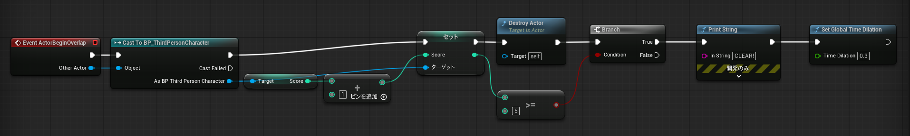

import demoCompleteVideoUrl from './assets/demo-complete.mp4'

今日つくるゲームのイメージ

<video controls width="100%" style={{borderRadius: '8px'}}>
  <source src={demoCompleteVideoUrl} type="video/mp4" />
</video>

今日は90分で、ゲームを1本完成させます。

[最新の完成版を GitHub Releases からダウンロード](https://github.com/metyatech/OpenCampus-UE90min/releases/latest)

Release ページの Assets から `UE90min-Win64-Development-*.7z` を選んでください。分割されている場合は、すべてダウンロードして `.001` から展開します。

作るのは3Dキャラクターを動かしてアイテムを集め、最後の 1 個を取った瞬間に画面にクリア表示が出るミニゲームです。小さいゲームですが、「**当たり判定**」「**イベント**」「**条件分岐**」というどんなゲームにも使われる3つの考え方が入っています。

使うのは Unreal Engine と、ノードをつなぐだけでロジックを作れる Blueprint という仕組みです。ノードをつなぐ操作は、**「触れたら何かする」「もし〇〇なら△△する」** といったプログラミングの考え方をそのまま視覚的に表現したものです。テキストを打つかわりに図で組み立てる、という違いだけで、やっていることはプログラミングと同じです。

全部を理解する必要はありません。作業を一つひとつ進めていくと、最後には「**ゲームってこうやって動くんだ**」という感覚が残るはずです。それを持ち帰ってもらえれば十分です。
