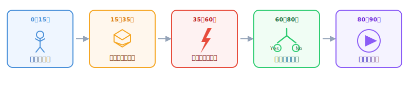

今日の90分は次の図の5つのフェーズで進みます。

## 最初の10分：まず動かす

Unreal Engine でプロジェクトを作り、3Dキャラクターが走り回る状態を作ります。

## 10〜30分：アイテムを作る

取れるアイテムを Blueprint クラスとして作り、レベルに配置します。

## 30〜55分：仕組みを入れる

アイテムに触れるとスコアが増えてアイテムが消える、という仕組みを Blueprint で組みます。

## 55〜75分：ルールを作る

「スコアが規定数に達してからゴールに入るとクリア」という条件を Blueprint で実装します。

## 最後の15分：通しプレイ

スタートからクリアまでを通しプレイして完成を確かめます。

:::tip[困ったときは]
いつでも手を挙げてください。サポートします。
:::
