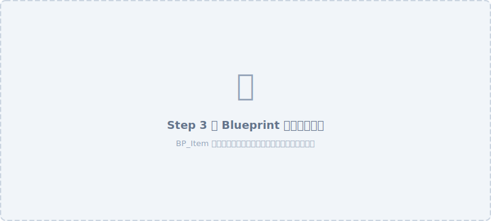
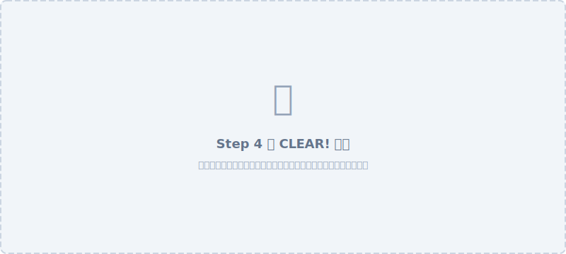
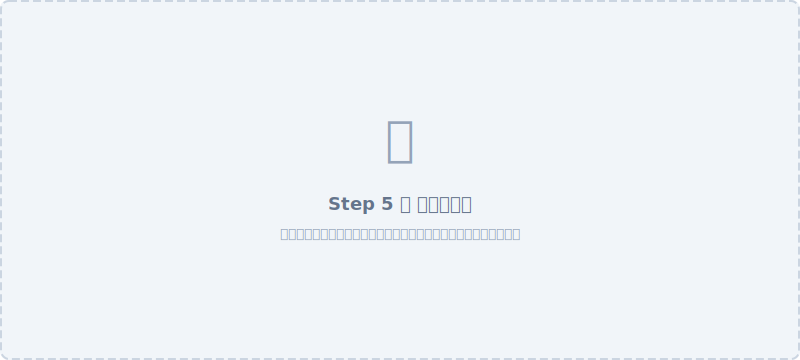

import projectZipUrl from './assets/UE90min.zip'
import { createCourseDownloadUrl } from '@metyatech/course-docs-platform/mdx'

ここから実際に手を動かして作っていきます。

このページの手順をひとつずつ進めれば、最後にはキャラクターが動いてアイテムを集めてクリアになるゲームが完成します。わからなくなったら、今どのステップにいるかをこのページで確認してから講師に声をかけてください。

**今日完成させるもの：**

| 機能 | 内容 |
|---|---|
| キャラクター操作 | WASD で移動、Space でジャンプ |
| アイテム取得 | 触れたら消えてスコアが 1 増える |
| クリア条件 | 5個以上集めてからゴールに入るとクリア画面が表示される |

---

## 画面の見方

手順でよく出てくるパネル名を確認しておきましょう。

| パネル名 | 場所 | 役割 |
|---|---|---|
| **メインビューポート** | 中央 | 3Dシーンを表示・編集する作業台 |
| **アウトライナー** | 右上 | シーンにある全オブジェクトの一覧 |
| **詳細パネル** | 右下 | 選択中のオブジェクトの設定を表示・変更 |
| **コンテンツブラウザ** | 下部 | プロジェクトのファイルをフォルダで管理 |

---

:::tip[こまめに保存しましょう]
作業中は **Ctrl + Shift + S**（すべて保存）を使ってこまめに保存しましょう。  
保存しないと、万が一のトラブルで作業が消えてしまうことがあります。
:::

---

## Step 1：プロジェクトを作って動かす（0〜15分）

このステップが終わると、キャラクターを自分で動かせるようになります！

:::note[1-1・1-2 を省略する場合]
**1-1・1-2 は次のダウンロードリンクからプロジェクトファイルをダウンロードすることで省略できます**

<a href={createCourseDownloadUrl(projectZipUrl, 'UE90min.zip')} download="UE90min.zip">UE90min.zip をダウンロード</a>

省略する場合は、zip を展開して、中の `UE90min.uproject` をダブルクリックしてプロジェクトを開き、**1-3 から**始めてください。
:::

### 1-1. Unreal Engine 5 を起動する

Unreal Engine 5 を起動すると、次のような画面が表示されます。


### 1-2. テンプレートを選ぶ

左側から「新規プロジェクト」を押して、「新規プロジェクト」ウィンドウを開きます。  


次のように設定します。  

1. 「新規プロジェクト」ウィンドウで、左側カテゴリから「**ゲーム**」を選択します
2. 中央のテンプレート一覧から「**三人称**」を選択します
3. 右側のブループリント/C++ の設定で「**ブループリント**」を選択します
4. 設定を以下のようにします

    | 設定項目 | 選択する値 |
    |---|---|
    | ターゲット プラットフォーム | **Desktop** |
    | 品質プリセット | **Maximum** |
    | バリアント | **なし** |

5. 保存先はデスクトップ、プロジェクト名は「**UE90min**」と入力します
6. 「**作成**」をクリックします  
**→ しばらく読み込みが続いたあとに、次のような Unreal Engine のメイン画面が開けば起動成功です。**  


### 1-3. プレイして動かしてみる

次のようにゲームをプレイします。

1. 上部ツールバーの **緑の「▶ プレイ」ボタン**をクリックします
2. **ビューポートをクリック**します（*クリックでカーソルが消えて、ゲーム操作が有効になります*）
3. キャラクターを動かしてみましょう

| キー | 動作 |
|---|---|
| **W / A / S / D** | 前後左右に移動 |
| **Space** | ジャンプ |
| **マウスの移動** | カメラの向きを変える |

4. 確認できたら **Esc を押してプレイを終了**します（終了したら再びカーソルが表示されます）

:::caution[操作できないときは]
再生後は必ずビューポートを 1 回クリックします。クリックしないとキー入力がゲームに届きません。
:::

---

:::tip[Step 1 確認ポイント]
- W/A/S/D でキャラクターが動く
- Space でジャンプできる
- Esc でプレイを終了できる

3つすべて確認できたら次に進みましょう。
:::

---

### 演習1：アイテムをどこに置くか計画しよう

<Exercise>

プレイしながら、**アイテムを置きたい場所を 5 か所**見つけてみましょう。次のステップで実際にそこへ置きます。

場所を選ぶときの条件：
- 走ってすぐ取れる「楽な場所」を 2〜3 か所
- ジャンプが必要な「少し難しい場所」を 1〜2 か所
- 実際に足で立てること（壁の中・床の下はNG）

5 か所決まったら Esc でプレイを終了してください。

<Solution>

置き場所の例：

- 楽な場所：スタート地点の近く、平らな床の上
- 難しい場所：ステージ中央の台の上、端の高台

ゲームとしておもしろいのは、**どれも取れるけど全部が同じ難易度ではない**配置です。次のステップでこの計画を実現していきましょう。

</Solution>
</Exercise>

---

## Step 2：アイテムを作って配置する（10〜30分）

このステップが終わると、ステージの上に取れるアイテムが並んだ状態になります。

:::note[ビューポートのカメラ移動]
編集中にビューポートの視点を動かしたいときは次の操作を使います。

| 操作 | 動作 |
|---|---|
| **右クリック + ドラッグ** | カメラの向きを変える |
| **右クリック中に W / A / S / D** | 前後左右に移動 |
| **右クリック中に Q / E** | 下・上に移動 |
| **右クリック中にマウスホイール** | 移動速度を変える（上で加速・下で減速） |

プレイ中のキャラクター操作とは別の操作です。**右クリックを押しながら**動かすのがポイントです。
:::

### 2-1. キューブをステージに置く

次のようにしてキューブをステージ上の好きな場所に配置します。

1. 「キューブに+」のアイコンを押す
2. 「形状」の上にカーソルを乗せる
3. 「キューブ」をクリックするか、ドラッグ&ドロップで好きな場所に配置

**→ キューブがステージ上に置かれます。**  


4. 配置したキューブを選択（選択するとオレンジの枠が付きます）すると、赤・青・緑の矢印（平行移動ギズモ）が出るはずです。
その状態で、矢印をドラッグすると位置を調整できます。

選択したときに矢印が出ない場合は、選択して **W キー**を押すか、ビューポート上部にあるを押して、**移動モードに切り替えてください**。
5. 歩いて触れるくらいの低い位置に移動しましょう。


### 2-2. 動作確認

「▶ プレイ」でキャラクターを動かして、キューブに近づけてみましょう。

**→ キャラクターがキューブにぶつかって止まるだけで、何も起きません。**

今のキューブはただの 3D の物体です。「触れたら何かする」という仕組みがまだ入っていないので、何も起きません。次のステップでこのキューブに仕組みを追加できるようにしていきます。

確認後、Esc でプレイを終了してください。

### 2-3. キューブを Blueprint クラスに変換する

先ほど、キューブに触れても何も起きないことを確認しました。これは「触れたら消える」「スコアが増える」といった動作がまだ設定されていないためです。Unreal Engine でオブジェクトに動作を設定するには、**Blueprint クラス**にする必要があります。

また、Blueprint クラスにすることで、同じ設定を持つコピーを何個でも簡単に作れるようになります。1 個設定すれば 5 個に増やせる、というわけです。

次の手順でブループリントクラスに変換します。

1. ビューポートで置いたキューブを**クリックして選択**します
2. 右の詳細パネルから、**ブループリントクラスへの変換ボタンを押す**


3. 次のように設定する
    | 設定項目 | 選択する値 |
    |---|---|
    | 作成方法 | **そのまま**（新しいサブクラス） |
    | 親クラス | **そのまま**（StaticMeshActor） |
    | ブループリント名 | **BP_Item** |
    | パス | **そのまま**（/All/Game） |
4. 「**選択**」をクリックします

**→ `BP_Item` という Blueprint ファイルが作成され、編集画面も開き、さきほどのキューブが `BP_Item` に変換されます。**


:::note[「BP_」プレフィックスの意味]
ファイル名の先頭に「BP_」を付ける慣習があります。一覧を見たときに「これは Blueprint だ」とすぐわかるようにするためです。
:::

5. 自動的に開いた `BP_Item` の編集画面は今は使いません。タブの「**×**」をクリックして閉じてください。


### 2-4. BP_Item をレベルに 5 つ配置する

画面下部の**コンテンツブラウザ**から「**BP_Item**」をビューポートに**ドラッグ＆ドロップ**で様々な位置に配置しましょう。  
合計5つになるようにしてください。  
**好きな場所に配置しましょう。**（下の画像とは違う配置にしてみましょう）


:::tip[配置のヒント]
「すぐ取れる楽な場所」と「ジャンプが必要な少し難しい場所」を混ぜると、ゲームとして面白くなります。  
壁や床の中に完全に埋まって取れなくなってしまう場所には置かないようにしましょう。  
置けたら、プレイして実際に歩いて全部触れるか確認してみましょう。
:::

:::tip[Step 2 確認ポイント]
- ステージ上（またはアウトライナー）に「BP_Item」が 5 つある
:::

---

## Step 3：触れたら消えてスコアが増えるようにする（30〜55分）

このステップが終わると、アイテムに触れるたびに**アイテムが消えてスコアが増えるようになります**。このステップが今日いちばん大事なポイントです！

---

**このステップで作る**「2つの別々の仕組み」**：**

| 仕組み | 片方だけ設定するとどうなる？ |
|---|---|
| **アイテムが消える** | スコアは増えない |
| **スコアが 1 増える** | アイテムが消えない（何度でも取れてしまう） |

どちらか片方だけ設定してもゲームとして成り立たないので、**2つ両方を作ります。**

**このゲームでのスコア：** 「プレイヤーが何個アイテムを取ったか」を表す数値として定義します。ゲームの中で記憶しておく必要があるため、「**変数**」として保存します。

---

ゲームはこの基本形の積み重ねで動いています。

**「何かが起きたら（イベント）→ 状態が変わる（変数の更新）→ 結果が出る（アクション）」**


---

### 3-1. プレイヤーキャラクターに Score 変数を追加する

スコアを記録する「変数」を作ります。**変数はゲームの状態を記憶する入れ物**です。

1. コンテンツブラウザで **Content → ThirdPerson → Blueprints** フォルダを開きます
2. 「**BP_ThirdPersonCharacter**」をダブルクリックします（プレイヤーキャラクターの Blueprint です）
3. Blueprint エディタが開いたら、**左側の「マイブループリント」パネル**を確認します
4. 「**変数**」セクション右隣の「**＋ アイコン**」をクリックします
5. 新しい変数が作られます。名前を「**Score**」に変更します
6. 変数「Score」を選択した状態で、右側の**詳細パネル**を確認します
7. 「**変数の型**」を「**Integer（整数）**」に設定します

:::note[変数の型について]
- 数を記録するときは「Integer（整数）」
- True/False を記録するときは「Boolean（ブーリアン）」
- 文字を記録するときは「String（文字列）」
:::

8. ツールバーの「**コンパイル**」ボタンをクリックします
9. 「**保存**」ボタンをクリックします

---

### 3-2. BP_Item を開いて衝突判定を追加する

1. コンテンツブラウザで「**BP_Item**」をダブルクリックして Blueprint エディタを開きます
2. **左上の「コンポーネント」パネル**の「**追加（Add）**」ボタンをクリックします
3. 検索ボックスに「**Box**」と入力します
4. 「**Box Collision**」を選択します

**→ キューブの周りに緑のワイヤーフレームの箱が表示されます。これが「触れたことを検知する範囲」です。**

5. コンポーネントパネルで「Box」が追加されていることを確認します
6. Box を選択した状態で、右側詳細パネルの「**Shape（形状）**」の Box Extent を少し大きめに設定します（例：X=55, Y=55, Z=55）

---

### 3-3. Overlap イベントを作る

「Box Collision の範囲に何かが侵入したとき」に処理が動くイベントを設置します。

1. コンポーネントパネルで「**Box**」を**右クリック**します
2. 「**イベントを追加**」→「**On Component Begin Overlap**」を選択します

**→ イベントグラフに「On Component Begin Overlap (Box)」ノードが表示されます。**

このノードが「何かが Box に触れた瞬間に処理を起動する」スイッチです。

---

### 3-4. Blueprint ロジックを組む

ノードをつないで「触れたらスコアを増やし、アイテムを消す」ロジックを作ります。

**完成系のノードの流れ：**

```
[On Component Begin Overlap (Box)]
        ↓ (実行)
[Cast To BP_ThirdPersonCharacter]  ← "Other Actor" ピンを接続
        ↓ (Cast Succeeded)
[Set Score]  ← 現在の Score + 1 を入力  【スコアを増やす】
        ↓
[Destroy Actor]                             【アイテムを消す】
```

`Set Score` と `Destroy Actor` は**別々の操作**です。両方つないで初めて「消えてスコア増加」が完成します。

それぞれの手順を以下で説明します。

---

**① Cast To BP_ThirdPersonCharacter ノードを追加する**

「触れたオブジェクトが本当にプレイヤーかどうか」を確認するノードです。

1. イベントグラフの空いている場所で**右クリック**します
2. 検索ボックスに「**Cast To BP_ThirdPersonCharacter**」と入力します
3. 一覧に表示されたら選択してノードを配置します

---

**② Other Actor ピンを接続する**

1. `On Component Begin Overlap (Box)` ノードの右側にある **「Other Actor」ピン**（オレンジ色）をドラッグします
2. `Cast To BP_ThirdPersonCharacter` ノードの **「Object」ピン**につなぎます

---

**③ 実行ピンをつなぐ**

1. `On Component Begin Overlap (Box)` ノードの**左上の白い矢印ピン（実行ピン）**をドラッグします
2. `Cast To BP_ThirdPersonCharacter` の**左側の実行ピン**につなぎます

---

**④ 【スコアを増やす】Score を +1 する**

1. `Cast To BP_ThirdPersonCharacter` ノードの **「As BP Third Person Character」ピン**（青いピン）をドラッグして、空の場所で離します
2. 検索ボックスが表示されるので「**Get Score**」と入力して選択します
3. 追加された「Get Score」ノードの**オレンジの出力ピン**をドラッグして空の場所で離します
4. 検索ボックスに「**integer + integer**」（または「**+**」）と入力して選択します
5. 追加された `+` ノードの「**B**」入力に「**1**」と入力します

---

**⑤ 【スコアを増やす】Set Score でキャラクターのスコアを更新する**

1. もう一度 `Cast To BP_ThirdPersonCharacter` の **「As BP Third Person Character」ピン**をドラッグして空の場所で離します
2. 「**Set Score**」と入力して選択します
3. `Set Score` ノードの **Score 入力ピン（整数）** を `+` ノードの**出力ピン**につなぎます
4. `Cast To BP_ThirdPersonCharacter` の **「Cast Succeeded」実行ピン**を `Set Score` の**実行ピン**につなぎます

---

**⑥ 【アイテムを消す】Destroy Actor**

1. `Set Score` ノードの右側の**実行ピン**をドラッグします
2. 「**Destroy Actor**」を検索して選択します

---

**⑦ コンパイルして保存する**

1. 「**コンパイル**」ボタンをクリックします
2. エラー（赤いメッセージ）が出ていないか確認します
3. 「**保存**」ボタンをクリックします

---

### 3-5. テストプレイで確認する

1. **メインエディタに戻り**、「**▶ プレイ**」をクリックします
2. キャラクターをアイテムのそばまで動かし、**アイテムに触れてみます**

**→ アイテムが消えれば成功です。**

:::caution[アイテムが消えないときのチェック]
- `Box Collision` のサイズが十分あるか確認する
- Overlap イベントのノードが正しくつながっているか確認する
- キャスト先が「BP_ThirdPersonCharacter」になっているか確認する
- 「コンパイル」と「保存」を再度実行してみる
:::

---



:::tip[Step 3 確認ポイント]
- アイテムに触れると消える
- 複数のアイテムを取ると、それぞれ消える
:::

---

### 演習3：スコアの仕組みを確かめよう

<Exercise>

以下を試してみましょう。
1. 全部のアイテムを取ってみます。すべて消えますか？
2. プレイを一度終了して（Esc）、もう一度プレイしたとき、アイテムは元通りになっていますか？

時間が余ったら：`BP_Item` の「+」ノードの `B` 入力の数値を変えると、1 個取ったときのスコア増加量が変わります。何に変えると何が起きるか試してみましょう。

<Solution>

1. 全部取るとすべて消えます。
2. Esc でプレイを終了して再度 Play するとアイテムはリセットされます。

**スコア増加量の変え方：** `BP_Item` を開き、「+」ノードの `B` 入力を `2` に変えてコンパイル・保存します。1 個取るとスコアが 2 増えます。確認できたら `1` に戻しておきましょう。

</Solution>
</Exercise>

---

## Step 4：ゴールを作ってクリア条件を設定する（55〜75分）

このステップが終わると、「アイテムを十分集めてからゴールに入るとクリアになる」ゲームが完成します！

---

**このステップで作るもの：**

| 動作 | 仕組み |
|---|---|
| スコアが 5 未満の状態でゴールに入る | 何も起きない |
| スコアが 5 以上の状態でゴールに入る | 「CLEAR!」画面が表示される |

「何個集めればクリアか」という数値を **RequiredScore（必要スコア）** という変数で管理します。この変数を変えるだけでクリア条件を自由に調整できるようにします。

---

### 4-1. BP_Goal を新規作成する

1. コンテンツブラウザの空いている場所で**右クリック**します
2. 「**Blueprint クラスを作成**」を選択します
3. クラスを選ぶダイアログで「**Actor**」を選択します
4. 名前を「**BP_Goal**」にします

---

### 4-2. BP_Goal に見た目と衝突判定を追加する

「**BP_Goal**」をダブルクリックして Blueprint エディタを開きます。

**見た目（Static Mesh）を追加する**

1. コンポーネントパネルの「**追加**」ボタンをクリックします
2. 「**Static Mesh**」を検索して追加します
3. 追加された `StaticMesh` を選択した状態で、右側の詳細パネルの「**Static Mesh**」欄をクリックします
4. 検索ボックスに「**Cylinder**」と入力し、「Cylinder」メッシュを選択します（見た目はわかりやすければ何でも構いません）

**衝突判定（Box Collision）を追加する**

1. コンポーネントパネルの「**追加**」ボタンをクリックします
2. 「**Box Collision**」を検索して追加します
3. Box Collision のサイズをゴールとして使いやすい大きさに調整します（Box Extent を X=200, Y=200, Z=200 程度にするとわかりやすいです）

---

### 4-3. RequiredScore 変数を追加する

「クリアに必要な個数」を変数で管理します。

1. 左下の「**マイブループリント**」パネルの「**変数 ＋**」をクリックします
2. 名前を「**RequiredScore**」にします
3. 型を「**Integer（整数）**」にします
4. 詳細パネルで「**インスタンス編集可能**」にチェックを入れます（レベルエディタ上でも値を直接変更できるようになります）
5. 「**コンパイル**」をクリックします
6. 詳細パネルの「**デフォルト値**」を「**5**」に設定します

---

### 4-4. クリア判定ロジックを作る

まず `Box Collision` の Overlap イベントを設定します。

**① Overlap イベントを作る**

1. コンポーネントパネルで「**Box**」を右クリックします
2. 「**イベントを追加**」→「**On Component Begin Overlap**」を選択します

---

**完成系のノードの流れ：**

```
[On Component Begin Overlap (Box)]
        ↓ (実行)
[Cast To BP_ThirdPersonCharacter]  ← "Other Actor" ピンを接続
        ↓ (Cast Succeeded)
[Branch（分岐）]  ← Condition: Score >= RequiredScore
        ↓ True
[Create Widget]  ← Class: WBP_Clear
        ↓
[Add to Viewport]
```

---

**② Cast To BP_ThirdPersonCharacter （Step 3 と同じ手順）**

1. 右クリック → 「**Cast To BP_ThirdPersonCharacter**」を追加します
2. `Other Actor` → `Object` につなぎます
3. 実行ピンもつなぎます

---

**③ スコアの比較（Branch ノード）を作る**

1. `Cast To BP_ThirdPersonCharacter` の「**As BP Third Person Character**」ピンをドラッグして「**Get Score**」を追加します
2. 「**Cast Succeeded**」実行ピンをドラッグして「**Branch**」（分岐）ノードを追加します（「If」と検索しても出てきます）
3. `Get Score` の出力ピンをドラッグして空の場所で離します
4. 「**>=**」と入力し、「**Integer >= Integer**」を選択します
5. `>=` ノードの右下の入力ピンをドラッグして「**Get RequiredScore**」を追加します（「Self」ノードから引き出します）
6. `>=` ノードの出力ピンを `Branch` ノードの「**Condition**」ピンにつなぎます

---

**④ Widget Blueprint（クリア画面）を作成する**

先にクリア時に表示する画面を作ります。

1. コンテンツブラウザで右クリック → 「**ユーザーインターフェイス**」→「**Widget Blueprint**」を選択します
2. 名前を「**WBP_Clear**」にします
3. 「**WBP_Clear**」をダブルクリックして Widget エディタを開きます
4. 左側の「**パレット**」パネルから「**Text**」をキャンバスにドラッグします
5. テキストを選択して、右側の詳細パネルで「**Text**」の値を「**CLEAR!**」に変更します
6. フォントサイズを「**72**」程度に大きくします
7. 「**コンパイル**」→「**保存**」をクリックします
8. Widget エディタを閉じます

---

**⑤ BP_Goal にクリア処理をつなぐ**

1. `BP_Goal` の Blueprint エディタに戻ります
2. `Branch` ノードの「**True**」実行ピンをドラッグします
3. 「**Create Widget**」を検索して追加します
4. `Create Widget` ノードの「**Class**」欄をクリックして「**WBP_Clear**」を選択します
5. `Create Widget` の「**Return Value**」ピンをドラッグして「**Add to Viewport**」を追加します
6. 実行ピンもつなぎます
7. 「**コンパイル**」→「**保存**」をクリックします

---

### 4-5. レベルに BP_Goal を置く

1. コンテンツブラウザから「**BP_Goal**」をレベルにドラッグして配置します
2. ステージの端や目立つ場所など、プレイヤーが見つけやすい位置に置きます

---



:::tip[Step 4 確認ポイント]
- レベルに BP_Goal が置かれている
- アイテムを 4個以下しか取っていない状態でゴールに入っても何も起きない
- 5個すべて取ってからゴールに入ると「CLEAR!」と表示される

**確認方法：** まず 2〜3 個だけ取ってゴールに入り、何も起きないことを確認します。次に残りも全部取ってからゴールに入ります。
:::

---

### 演習4：クリア条件を変えてみよう

<Exercise>

`BP_Goal` の `RequiredScore` を変えてクリア条件を調整してみましょう。

1. RequiredScore を「3」に変えて、3 個集めてからゴールに入るとクリアになることを確認する
2. 動作確認したら RequiredScore を「5」に戻す

`RequiredScore` はどこで変えられますか？Blueprint を開かずに変更できます。

<Solution>

レベルエディタで `BP_Goal` をクリックし、右側の詳細パネルに表示される「Required Score」の値を変更します。「インスタンス編集可能」に設定してあるので、Blueprint を開かずに直接変更できます。

</Solution>
</Exercise>

---

## Step 5：完成・通しプレイ（75〜90分）

最初から最後まで一通りプレイして、ゲームの完成を確認しましょう！

### 5-1. 最終チェック

プレイする前に以下を確認します。

- レベルに `BP_Item` が 5 つ配置されている
- レベルに `BP_Goal` が 1 つ配置されている
- すべての Blueprint が「コンパイル済み・保存済み」になっている

:::caution[コンパイルミスを確認するには]
ツールバーに赤いエラーアイコンが表示されている場合は、それをクリックするとエラーの内容を確認できます。
:::

### 5-2. 通しプレイ

1. 「**▶ プレイ**」をクリックします
2. **全部のアイテムを無視してゴールに向かいます** → 何も起きないことを確認します
3. **全部のアイテムを集めてからゴールに入ります** → 「CLEAR!」が表示されることを確認します

**→ ここまで確認できたら、今日のゲームは完成です！**



### 振り返り

あなたが今日作ったゲームには、3 つの重要な考え方が使われています。

| 仕組み | 今日の使い方 |
|---|---|
| **イベント** | 「何かに触れたとき」に処理を開始する |
| **変数** | スコアをゲームの中で記憶する |
| **条件分岐** | 「スコアが足りているかどうか」で処理を分ける |

この 3 つはどんなゲームにも、ゲーム以外のアプリにも共通して出てきます。

---

:::tip[完成確認]
- ✅ キャラクターを動かせる
- ✅ アイテムを取ると消える
- ✅ 5 個集めてからゴールに入るとクリアになる
:::

---

## 困ったときの確認手順

うまくいかないときは、以下を順番に確認してください。

1. **「コンパイル」と「保存」をしたか確認する**
   Blueprint を編集したあとは、必ずコンパイルと保存が必要です。忘れると変更が反映されません。

2. **ノードの接続が途切れていないか確認する**
   実行ピン（白い矢印）とデータピン（色のついた丸）がすべてつながっているか確認しましょう。

3. **変数の型を確認する**
   Score は「Integer（整数）」で作りましたか？ Boolean（True/False）にしていると動きません。

4. **アウトライナーで Blueprint の種類を確認する**
   「BP_Item」と「BP_Goal」が正しく置かれているか確認しましょう。「Cube」や「Actor」のままになっていることがあります。

---

## 発展演習：ゲームをカスタマイズしよう

早く完成した人向けの演習です。好きなものを選んで挑戦してください。

### 演習-発展1：アイテムを増やしてゲームを再設計する

<Exercise>

現在はアイテムが 5 個あります。10 個に増やし、クリア条件を 8 個に変えてみましょう。

<Solution>

- コンテンツブラウザから `BP_Item` をレベルにドラッグして 5 個追加する
- レベルの `BP_Goal` を選択して、詳細パネルの `Required Score` を `8` に変更する

</Solution>
</Exercise>

### 演習-発展2：クリアメッセージを自分の言葉に変える

<Exercise>

「CLEAR!」というテキストを自分の好きなメッセージに変えてみましょう。フォントカラーやサイズも変えてみましょう。

<Solution>

1. コンテンツブラウザで `WBP_Clear` をダブルクリックして Widget エディタを開く
2. テキストブロックを選択して、詳細パネルの「Text」を好きな内容に変更する
3. 「Font」「Color and Opacity」も詳細パネルから変更できます

</Solution>
</Exercise>

### 演習-発展3：アイテムの形を変える

<Exercise>

現在のアイテムは白いキューブです。Sphere（球）など別の形に変えてみましょう。

<Solution>

1. コンテンツブラウザで `BP_Item` をダブルクリックして Blueprint エディタを開く
2. コンポーネントパネルで「StaticMesh」を選択する
3. 詳細パネルの「Static Mesh」を別のメッシュに変更する（Sphere, Cylinder, Cone などが選べます）

</Solution>
</Exercise>

### 演習-発展4：ゴールの見た目をわかりやすくする

<Exercise>

プレイヤーがゴールをすぐ見つけられるように、見た目を目立たせてみましょう。

<Solution>

- `BP_Goal` の Blueprint を開き、StaticMesh コンポーネントを選択して詳細パネルの「Materials」欄から色のついたマテリアルを設定する
- Box Collision の位置や大きさを、見た目に合わせて調整する

</Solution>
</Exercise>

### 演習-発展5（上級）：スコアをゲーム中に画面表示する

<Exercise>

現在はスコアがいくつかを画面で確認できません。スコアをリアルタイムで表示してみましょう。

<Solution>

1. `WBP_Clear` と同じ手順で、新しい Widget Blueprint「`WBP_HUD`」を作成する
2. テキストブロックを追加して、テキストの「Bind（バインド）」ボタンから `Score` 変数を参照する
3. ゲーム開始時（`BP_ThirdPersonCharacter` の `Event Begin Play` ノード）に `WBP_HUD` を `Add to Viewport` で表示する

</Solution>
</Exercise>

---

お疲れ様でした！ゲームを完成させてくれてありがとうございます。

あなたが今日作ったゲームには、「**イベント**」「**変数**」「**条件分岐**」という 3 つの仕組みが入っています。この 3 つはどんなゲームにも使われる基本です。**ここからルールを1つ増やすたびに、作れるゲームの幅がどんどん広がっていきます。**
