import projectZipUrl from './assets/UE90min.zip'

ここから実際に手を動かして作っていきます。

このページの手順をひとつずつ進めれば、最後にはキャラクターが動いてアイテムを集めてクリアになるゲームが完成します。わからなくなったら、今どのステップにいるかをこのページで確認してから講師に声をかけてください。

**今日完成させるもの：**

| 機能 | 内容 |
|---|---|
| キャラクター操作 | WASD で移動、Space でジャンプ |
| アイテム取得 | 触れたら消えてスコアが 1 増える |
| クリア条件 | 5個以上集めてからゴールに入るとクリア画面が表示される |

---

## 画面の見方

手順でよく出てくるパネル名を確認しておきましょう。

| パネル名 | 場所 | 役割 |
|---|---|---|
| **メインビューポート** | 中央 | 3Dシーンを表示・編集する作業台 |
| **アウトライナー** | 右上 | シーンにある全オブジェクトの一覧 |
| **詳細パネル** | 右下 | 選択中のオブジェクトの設定を表示・変更 |
| **コンテンツブラウザ** | 下部 | プロジェクトのファイルをフォルダで管理 |

---

:::tip[こまめに保存しましょう]
作業中は **Ctrl + Shift + S**（すべて保存）を使ってこまめに保存しましょう。  
保存しないと、万が一のトラブルで作業が消えてしまうことがあります。
:::

---

## Step 1：プロジェクトを作って動かす（0〜15分）

このステップが終わると、キャラクターを自分で動かせるようになります！

:::note[1-1・1-2 を省略する場合]
**1-1・1-2 は次のダウンロードリンクからプロジェクトファイルをダウンロードすることで省略できます**

<DownloadLink file={projectZipUrl} filename="UE90min.zip">UE90min.zip をダウンロード</DownloadLink>

省略する場合は、zip を展開して、中の `UE90min.uproject` をダブルクリックしてプロジェクトを開き、**1-3 から**始めてください。
:::

### 1-1. Unreal Engine 5 を起動する

Unreal Engine 5 を起動すると、次のような画面が表示されます。

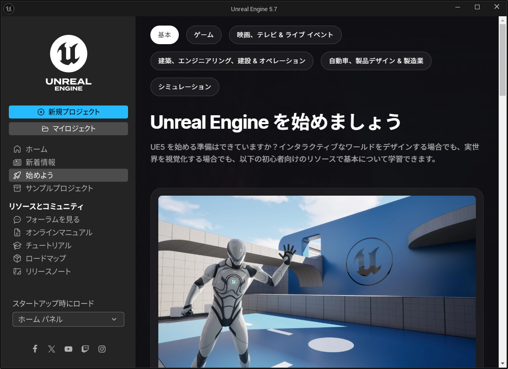

### 1-2. テンプレートを選ぶ

左側から「新規プロジェクト」を押して、「新規プロジェクト」ウィンドウを開きます。  
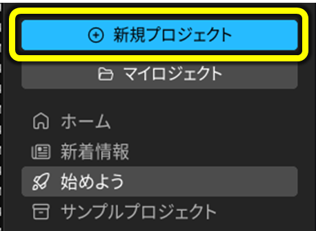

次のように設定します。  
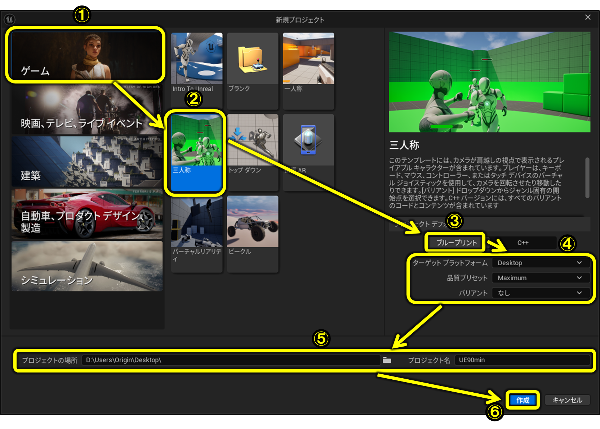
1. 「新規プロジェクト」ウィンドウで、左側カテゴリから「**ゲーム**」を選択します
2. 中央のテンプレート一覧から「**三人称**」を選択します
3. 右側のブループリント/C++ の設定で「**ブループリント**」を選択します
4. 設定を以下のようにします

    | 設定項目 | 選択する値 |
    |---|---|
    | ターゲット プラットフォーム | **Desktop** |
    | 品質プリセット | **Maximum** |
    | バリアント | **なし** |

5. 保存先はデスクトップ、プロジェクト名は「**UE90min**」と入力します
6. 「**作成**」をクリックします  
**→ しばらく読み込みが続いたあとに、次のような Unreal Engine のメイン画面が開けば起動成功です。**  
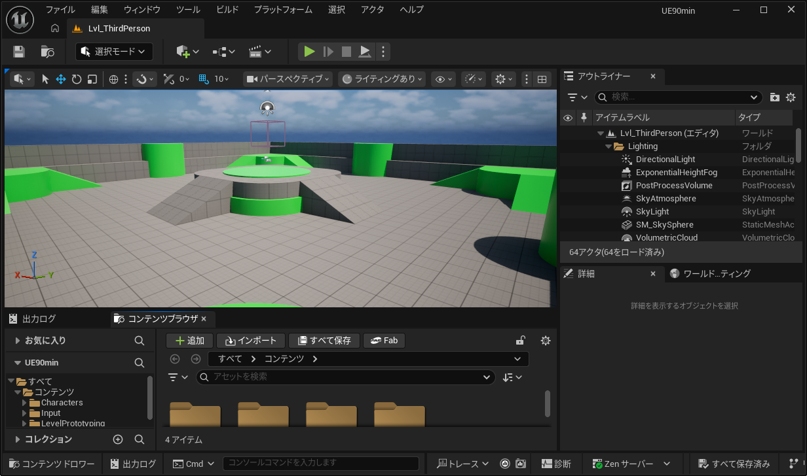

### 1-3. プレイして動かしてみる

次のようにゲームをプレイします。
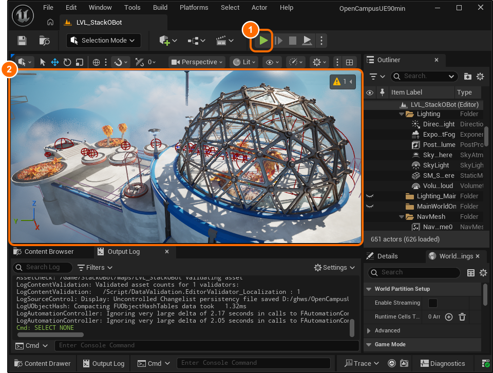
1. 上部ツールバーの **緑の「▶ プレイ」ボタン**をクリックします
2. **ビューポートをクリック**します（*クリックでカーソルが消えて、ゲーム操作が有効になります*）
3. キャラクターを動かしてみましょう

| キー | 動作 |
|---|---|
| **W / A / S / D** | 前後左右に移動 |
| **Space** | ジャンプ |
| **マウスの移動** | カメラの向きを変える |

4. 確認できたら **Esc を押してプレイを終了**します（終了したら再びカーソルが表示されます）

:::caution[操作できないときは]
再生後は必ずビューポートを 1 回クリックします。クリックしないとキー入力がゲームに届きません。
:::

---

:::tip[Step 1 確認ポイント]
- W/A/S/D でキャラクターが動く
- Space でジャンプできる
- Esc でプレイを終了できる

3つすべて確認できたら次に進みましょう。
:::

---

### 演習：アイテムをどこに置くか計画しよう

<Exercise>

プレイしながら、**アイテムを置きたい場所を 5 か所**見つけてみましょう。次のステップで実際にそこへ置きます。

場所を選ぶときの条件：
- 走ってすぐ取れる「楽な場所」を 2〜3 か所
- ジャンプが必要な「少し難しい場所」を 1〜2 か所
- 実際に足で立てること（壁の中・床の下はNG）

5 か所決まったら Esc でプレイを終了してください。

<Solution>

置き場所の例：

- 楽な場所：スタート地点の近く、平らな床の上
- 難しい場所：ステージ中央の台の上、端の高台

ゲームとしておもしろいのは、**どれも取れるけど全部が同じ難易度ではない**配置です。次のステップでこの計画を実現していきましょう。

</Solution>
</Exercise>

---

## Step 2：アイテムを作って配置する（10〜30分）

このステップが終わると、ステージの上に取れるアイテムが並んだ状態になります。

:::note[ビューポートのカメラ移動]
編集中にビューポートの視点を動かしたいときは次の操作を使います。

| 操作 | 動作 |
|---|---|
| **右クリック + ドラッグ** | カメラの向きを変える |
| **右クリック中に W / A / S / D** | 前後左右に移動 |
| **右クリック中に Q / E** | 下・上に移動 |
| **右クリック中にマウスホイール** | 移動速度を変える（上で加速・下で減速） |

プレイ中のキャラクター操作とは別の操作です。**右クリックを押しながら**動かすのがポイントです。
:::

### 2-1. キューブをステージに置く

次のようにしてキューブをステージ上の好きな場所に配置します。
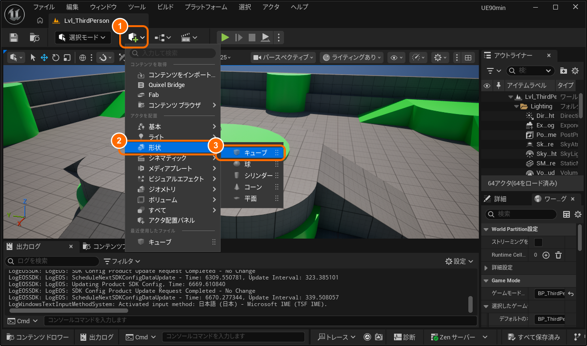
1. 「キューブに+」のアイコンを押す
2. 「形状」の上にカーソルを乗せる
3. 「キューブ」をクリックするか、ドラッグ&ドロップで好きな場所に配置

**→ キューブがステージ上に置かれます。**  
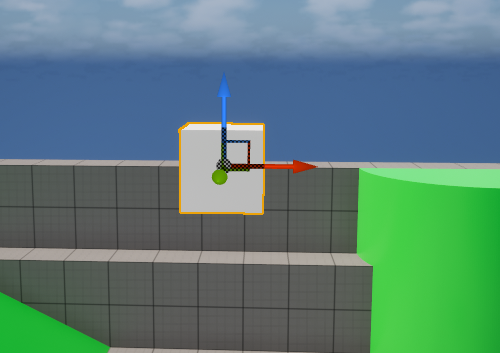

4. 配置したキューブを選択（選択するとオレンジの枠が付きます）すると、赤・青・緑の矢印（平行移動ギズモ）が出るはずです。
その状態で、矢印をドラッグすると位置を調整できます。
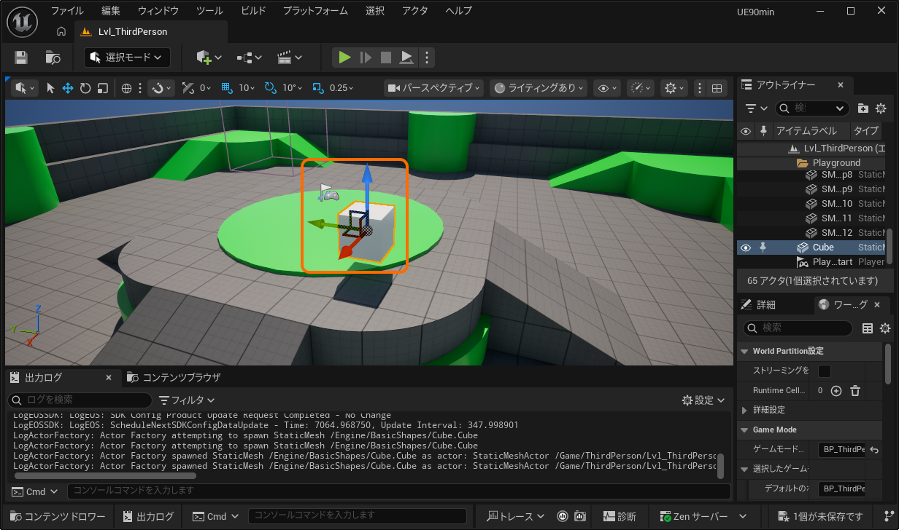
選択したときに矢印が出ない場合は、選択して **W キー**を押すか、ビューポート上部にあるを押して、**移動モードに切り替えてください**。
5. 歩いて触れるくらいの低い位置に移動しましょう。
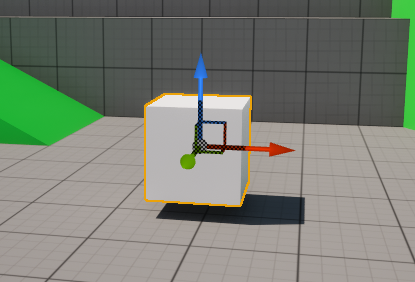

### 2-2. 動作確認

ではプレイ（▶）して、キャラクターを動かして、キューブに近づけてみましょう。

**→ キャラクターがキューブにぶつかって止まるだけで、何も起きません。**

今のキューブはただの 3D の物体です。「触れたら何かする」という仕組みがまだ入っていないので、何も起きません。次のステップでこのキューブに仕組みを追加できるようにしていきます。

確認後、Esc でプレイを終了してください。

### 2-3. キューブを Blueprint クラスに変換する

先ほど、キューブに触れても何も起きないことを確認しました。これは「触れたら消える」「スコアが増える」といった動作がまだ設定されていないためです。Unreal Engine でオブジェクトに動作を設定するには、**Blueprint クラス**にする必要があります。

また、Blueprint クラスにすることで、同じ設定を持つコピーを何個でも簡単に作れるようになります。1 個設定すれば 5 個に増やせる、というわけです。

次の手順でブループリントクラスに変換します。
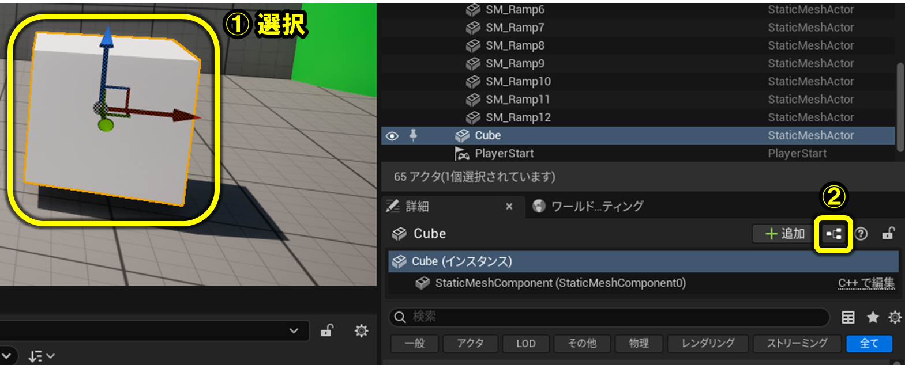
1. ビューポートで置いたキューブを**クリックして選択**します
2. 右の詳細パネルから、**ブループリントクラスへの変換ボタンを押す**

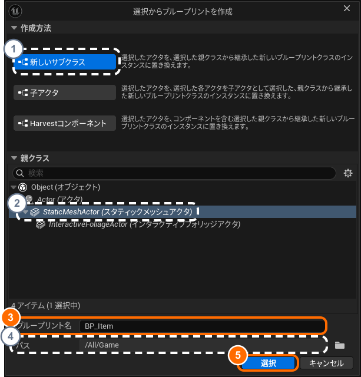
3. 次のように設定する
    | 設定項目 | 選択する値 |
    |---|---|
    | 作成方法 | **そのまま**（新しいサブクラス） |
    | 親クラス | **そのまま**（StaticMeshActor） |
    | ブループリント名 | **BP_Item** |
    | パス | **そのまま**（/All/Game） |
4. 「**選択**」をクリックします

**→ `BP_Item` という Blueprint ファイルが作成され、編集画面も開き、さきほどのキューブが `BP_Item` に変換されます。**


:::note[「BP_」プレフィックスの意味]
ファイル名の先頭に「BP_」を付ける慣習があります。一覧を見たときに「これは Blueprint だ」とすぐわかるようにするためです。
:::

5. 自動的に開いた `BP_Item` の編集画面は今は使いません。タブの「**×**」をクリックして閉じてください。
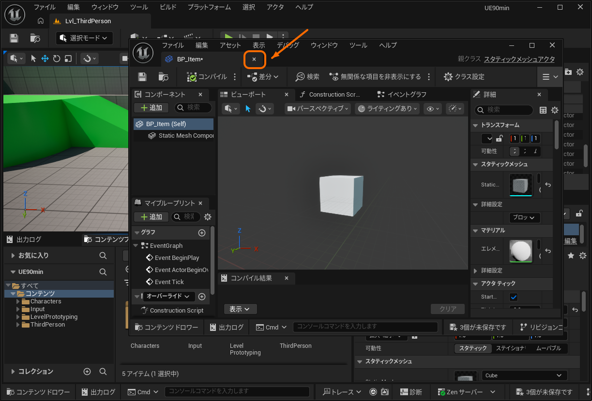

### 2-4. BP_Item をレベルに 5 つ配置する

画面下部の**コンテンツブラウザ**から「**BP_Item**」をビューポートに**ドラッグ＆ドロップ**で様々な位置に配置しましょう。  
合計5つになるようにしてください。  
**好きな場所に配置しましょう。**（下の画像とは違う配置にしてみましょう）
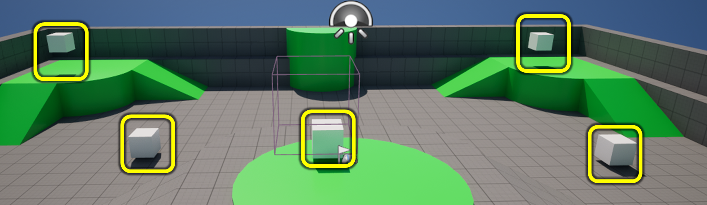

:::tip[配置のヒント]
「すぐ取れる楽な場所」と「ジャンプが必要な少し難しい場所」を混ぜると、ゲームとして面白くなります。  
壁や床の中に完全に埋まって取れなくなってしまう場所には置かないようにしましょう。  
置けたら、プレイして実際に歩いて全部触れるか確認してみましょう。
:::

:::tip[Step 2 確認ポイント]
- ステージ上（またはアウトライナー）に「BP_Item」が 5 つある
:::

---

## Step 3：触れたら消えてスコアが増えるようにする（30〜55分）

このステップが終わると、アイテムに触れるたびに**アイテムが消えてスコアが増えるようになります**。このステップが今日いちばん大事なポイントです！

---

**このステップで作る**「2つの別々の仕組み」**：**

| 仕組み | 片方だけ設定するとどうなる？ |
|---|---|
| **アイテムが消える** | スコアは増えない |
| **スコアが 1 増える** | アイテムが消えない（何度でも取れてしまう） |

どちらか片方だけ設定してもゲームとして成り立たないので、**2つ両方を作ります。**

**このゲームでのスコア：** 「プレイヤーが何個アイテムを取ったか」を表す数値とします。ゲームの中で記憶しておく必要があるため、「**変数**」として保存します。

---

ゲームはこの基本形の積み重ねで動いています。

**「何かが起きたら（イベント）→ 状態が変わる（変数の更新）→ 結果が出る（アクション）」**


---

### 3-1. プレイヤーキャラクターに Score 変数を追加する

スコアを記録する「変数」を作ります。**変数はゲームの状態を記憶する入れ物**です。

:::note[変数はどこに作る？]
変数はどの Blueprint にでも作れます。ただし、その変数を「誰が持つのか」を考えて置き場所を決める必要があります。

スコアは「このプレイヤーが何個取ったか」という情報なので、**プレイヤーキャラクターの Blueprint（BP_ThirdPersonCharacter）** に作るのが自然です。アイテム（BP_Item）に置くと、「それぞれのアイテムが別々のスコアの入れ物を持つ」ことになるため、データを保持しにくくなります。
プレイヤーであればゲーム中は常に存在するので、途中で消えたりしてスコアが消える心配もありません。
:::

以下の手順で、プレイヤーキャラクターの Blueprint に「Score」という変数を追加してみましょう。
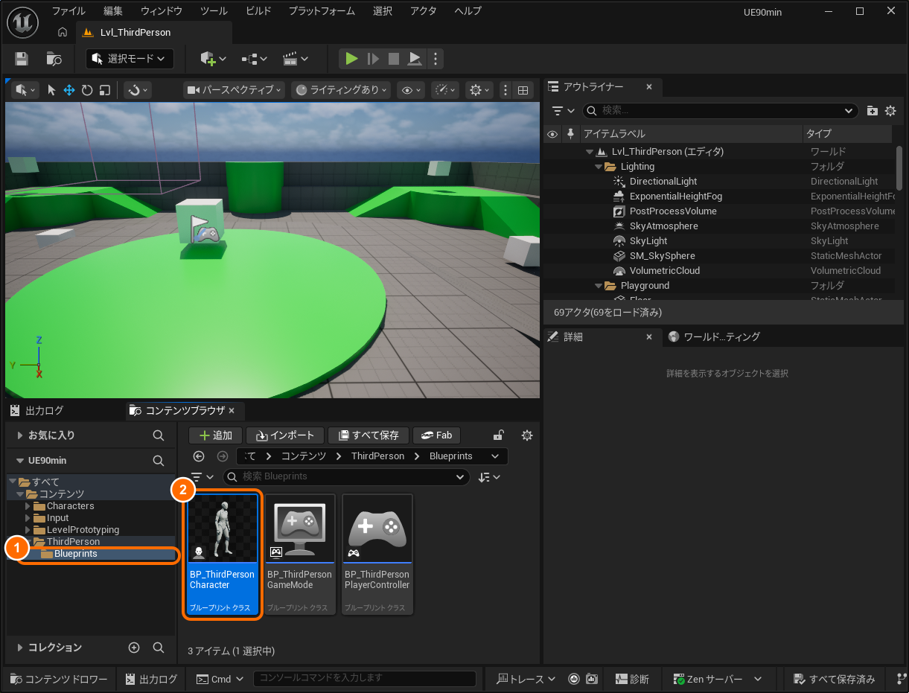
1. コンテンツブラウザで **コンテンツ → ThirdPerson → Blueprints** フォルダを開きます
2. 「**BP_ThirdPersonCharacter**」をダブルクリックします（プレイヤーキャラクターの Blueprint です）
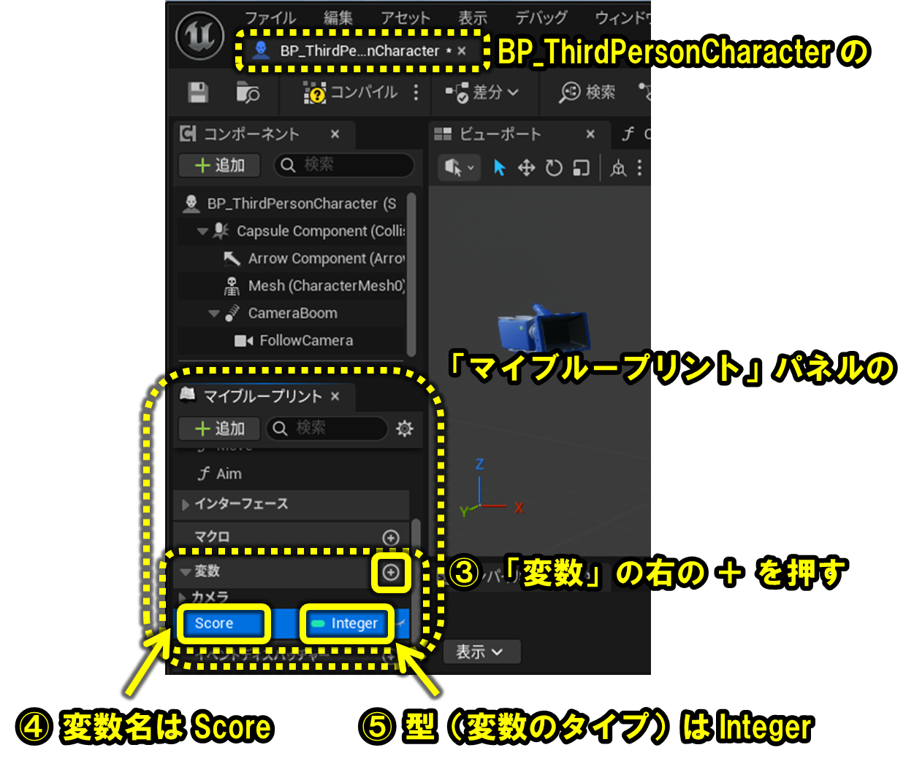
3. 「**BP_ThirdPersonCharacter**」の Blueprint エディタが開いたら、**左側の「マイブループリント」パネル**を確認し、「**変数**」セクション右の「**＋**」をクリックします
4. 新しい変数が作られます。名前を「**Score**」にします
5. 「**Score**」のすぐ右のドロップダウンをクリックして、**変数の型**を「**Integer**」（**整数**）にします

:::note[変数の型について]
変数は「何かを入れておける入れ物」ですが、入れ物ごとに **入れられるものの種類（型）** が決まっています。整数用の入れ物に文字は入れられません。

| 型 | 入れられるもの | 使いどころ |
|---|---|---|
| **Integer（整数）** | 1, 2, 3 … | スコア、個数、残機など |
| **Boolean（ブーリアン）** | True / False | フラグ、オン/オフの状態など |
| **String（文字列）** | "Hello" … | 名前、メッセージなど |

今回のスコアは「1個取った」「2個取った」のように**整数で十分**なので、Integer を選びます。
:::

6. タブの「**×**」をクリックして BP_ThirdPersonCharacter の編集画面を閉じます

---

### 3-2. BP_Item のコリジョン設定を変える

:::note[コリジョンとは]
**コリジョン（Collision）** とは、オブジェクト同士が「ぶつかった・触れた」ことをゲームが認識するための当たり判定のことです。

コリジョンには主に 2 種類の動作があります。

| 種類 | 動作 | 使いどころ |
|------|------|-----------|
| **ブロック** | 相手をはじいて通れなくする | 壁・床・障害物 |
| **オーバーラップ** | すり抜けられる＋触れたことだけ通知する | アイテム・ゴールゾーン |

BP_Item は元キューブなので最初からコリジョンが付いています。ただし初期設定は「ブロック」なので、今のままではプレイヤーがアイテムを押しのけるだけで、触れたことを検知できません。「オーバーラップ」に変えることで、すり抜けつつ触れた瞬間を検知できるようになります。
:::

BP_Item は元々キューブなので、最初からコリジョンがあります。ただし現在の設定は「プレイヤーをブロックする」専用で、触れたことを検知する機能はオフになっています。設定を変えて「触れたことを検知する」機能を有効にします。

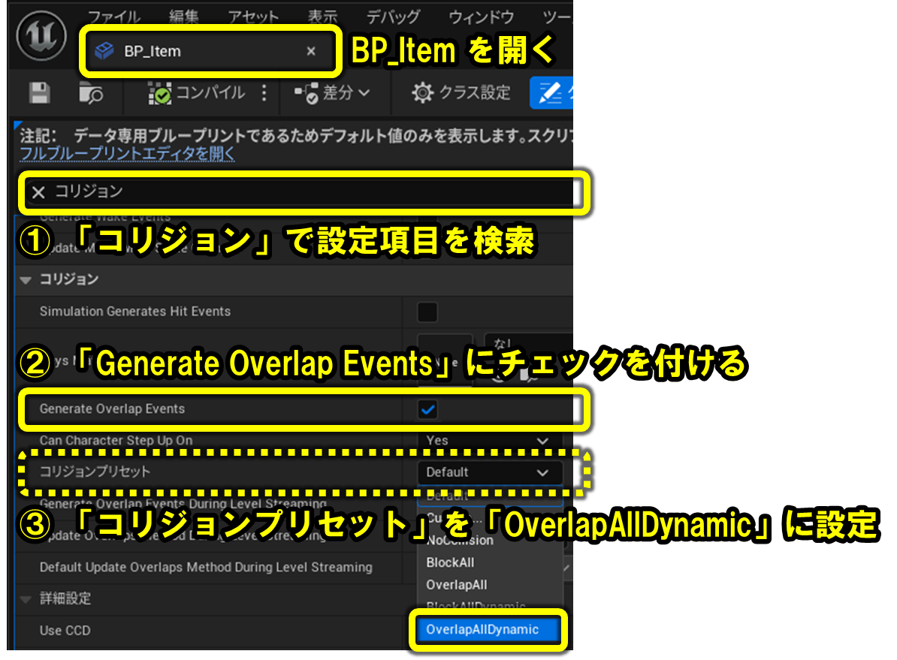
1. コンテンツブラウザで「**BP_Item**」をダブルクリックして Blueprint エディタを開き、「コリジョン」で検索
2. 「**コリジョン**」セクションの「**Generate Overlap Events**」のチェックボックスを「**オン**」にします
3. その下の「**コリジョンプリセット**」のドロップダウンを「**OverlapAllDynamic**」に変更します

**→ プレイヤーがアイテムをすり抜けて通れるようになり、触れたことを検知できる状態になります。**

---

### 3-3. Overlap イベントを使って動作確認する

アイテムに触れたとき、画面に「Hello」という文字が表示されるようにします。  
まずこれで「**触れたことを検知する**」仕組みの作り方を学びます。

#### イベントグラフを開く

1. 「**フルブループリントエディタを開く**」ボタンをクリックして、Blueprint エディタの全機能が使える画面に切り替えます

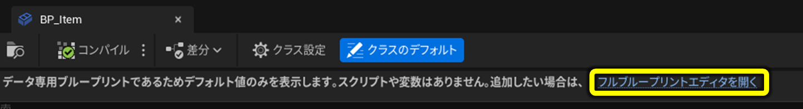

以下が **Blueprint エディタの全機能が使える画面**です。  
下の黄色枠の部分を**イベントグラフ**と呼びます。ここにノードというものを配置したりつなげたりして**ゲームの仕組みを書いていきます**。


:::note[イベントグラフの操作]

| キー / 操作 | 動作 |
|---|---|
| **右クリック + ドラッグ** | グラフをスクロール（パン） |
| **マウスホイール** | ズームイン／アウト |
| **Home キー** | 全ノードが画面に収まるように表示を合わせる |

ノードが見つからないときは Home キーで全体表示に戻りましょう。
:::

#### Event ActorBeginOverlap ノードを見つける

グラフ内で `Event ActorBeginOverlap` と書かれたノードを探してください。


:::note[Event ActorBeginOverlap とは]
「何かが触れた瞬間」に起動するノードです。
:::

#### Print String をつないで動作確認する

**キャラクターがアイテムに触れたとき画面に「Hello」という文字を出す**ために、`Event ActorBeginOverlap` ノードに **Print String** ノードをつなぎます。**Print String** は「**指定した文字を画面に表示する**」ノードで、仕組みが正しく動いているかを手軽に確認するために使います。

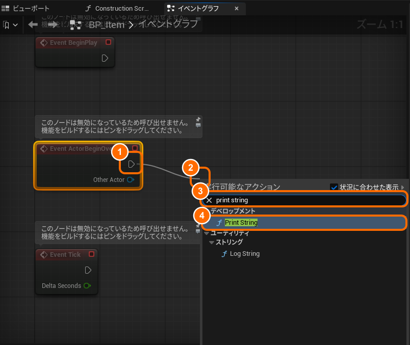
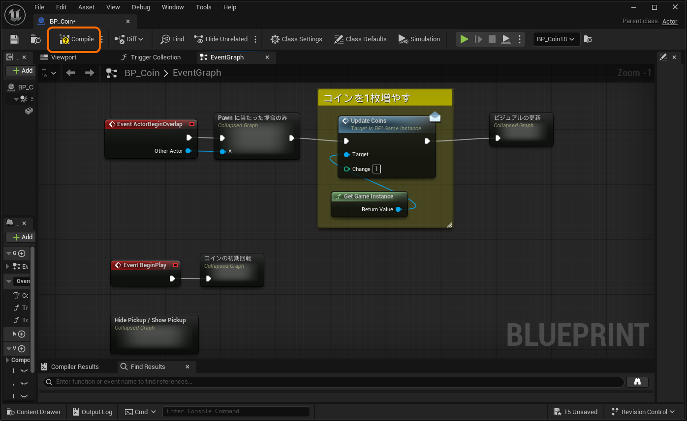
1. `Event ActorBeginOverlap` ノードの **実行ピン（白い矢印）** をドラッグし、
2. 空白で離します
3. 検索ボックスに「**Print String**」と入力して検索し、
4. 「**Print String**」を **Enter キー** を押して選択します
5. 「**コンパイル**」をクリックしてアイコンが**緑のチェック**になることを確認します

:::note[「コンパイル」とは]
「コンパイル」とは、**作ったノードの設定をゲームが実際に動かせる形に変換する作業**です。プレイボタンを押すと UE5 が自動でコンパイルしてくれますが、手動でコンパイルしておくとエラーをすぐに確認できます（アイコンが緑のチェック → 成功、赤の × → エラーあり）。ノードを組み終わったら一度押してアイコンを確認する習慣をつけておくと、問題を早く発見できます。
:::

全体的に次のようになっていればOKです。


#### テストプレイで確認する

ではメインのエディターに戻ってプレイ（▶）して、キャラクターを動かして、アイテムに触れてみましょう。

**→ 触れた瞬間に、次のように画面左上に小さく水色で「Hello」と表示されれば成功です。**
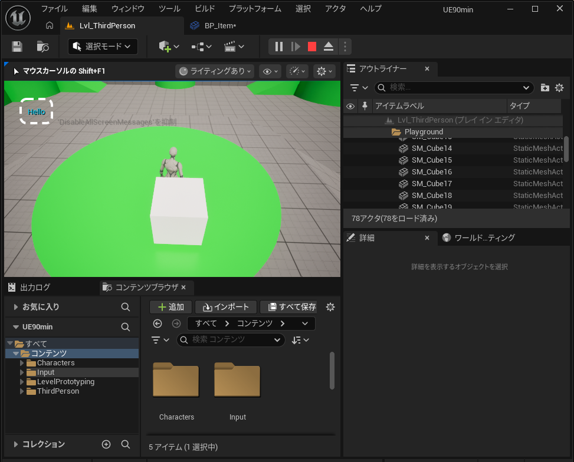

:::note[なぜ「Hello」が表示されたのか]


今やったことを振り返ると、次の2つが順番に働きました。

1. **Event ActorBeginOverlap** が「触れた瞬間」を起点にして処理を起動した
2. そこに **Print String** をつないでいたので、「Hello」が画面に表示された

この「**何かが起きたら → つないだ先の処理が順番に動いていく**」というのが、Blueprint の基本の流れです。次のステップでは Print String の代わりに「**スコアを増やす**」「**アイテムを消す**」処理をつないで、本番のゲームにします。
:::

#### Print String を削除する

次のステップに進む前に、確認用の Print String ノードを削除します。

1. `Print String` ノードをクリックして選択します
2. **Delete キー**を押して削除します
3. 「**コンパイル**」をクリックして緑のチェックになることを確認します

---

### 3-4. Blueprint ロジックを組む

本番の「触れたらスコアを増やし、アイテムを消す」ロジックを組みます。

**完成系のノードの流れ：**

```
[Event ActorBeginOverlap]
        ↓ (実行)
[Cast To BP_ThirdPersonCharacter]  ← "Other Actor" ピンを接続
        ↓ (Cast Succeeded)
[Set Score]  ← 現在の Score + 1 を入力  【スコアを増やす】
        ↓
[Destroy Actor]                             【アイテムを消す】
```

**スコアのセット** と **アイテムを消す** は**別々の操作**です。両方つないで初めて「スコア増加してアイテムが消える」が完成します。

それぞれの手順を以下で説明します。

---

1. **Cast To BP_ThirdPersonCharacter ノードを追加する**（「触れたオブジェクトが本当にプレイヤーかどうか」を確認するノードです）
    
    
    1. `Event ActorBeginOverlap` ノードの右側の**Other Actor（青いピン）**をドラッグして、空の場所で離します
    2.「**Cast To BP_ThirdPersonCharacter**」ノードを検索して配置します
2. 次に、**プレイヤーの【スコアを増やす】**。これは、**「キャラクターのスコアを現在のスコア + 1 に更新する」**という処理です。
そのため、まずは、現在のプレイヤーのスコアを取得して、1 を足すところから作ります。
    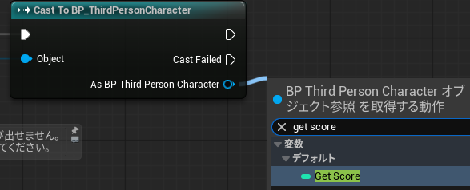
    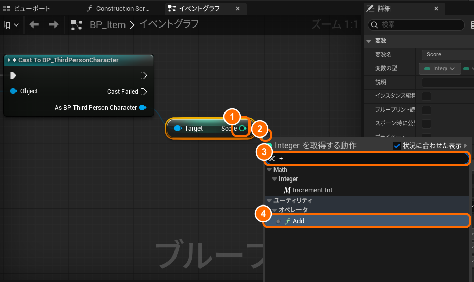
    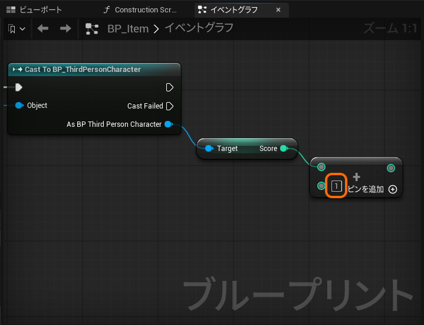
    1. `Cast To BP_ThirdPersonCharacter` ノードの右側の **「As BP Third Person Character」ピン**（青いピン）をドラッグして、空の場所で離し、「**Get Score**」ノードを検索して配置します
    2. 追加された「Get Score」ノードの右側の **「Score」ピン**（緑のピン）をドラッグして空の場所で離し、「**Add**」ノードを検索して配置します（「**+**」で検索できます）
    3. 追加された `+` ノードの下側の入力に「**1**」を直接入力します
3. このままではまだ現在のスコアに 1 を足す計算を行っただけで、Score 変数自体は更新されません。そこで、次にキャラクターのスコアを更新するノードを追加します。
    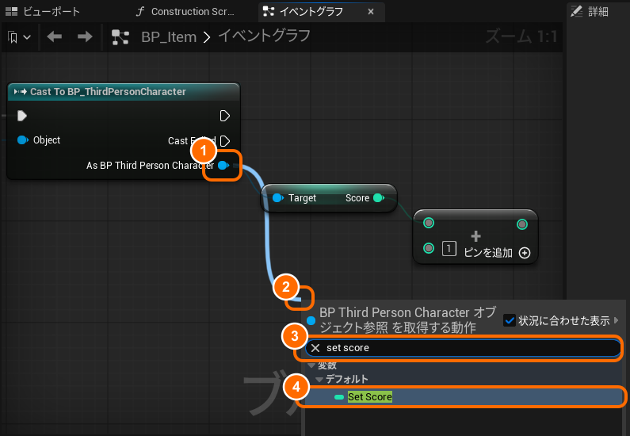
    
    
    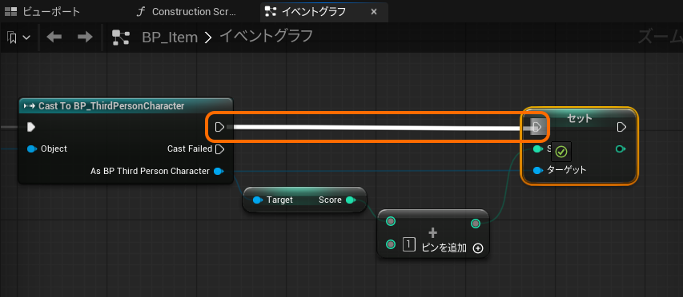
    1. もう一度 `Cast To BP_ThirdPersonCharacter` の **「As BP Third Person Character」ピン**をドラッグして空の場所で離し、「**Set Score**」ノードを検索して配置します
    2. 読みやすさのために、追加された「Set Score」ノードを、先ほどの `+` ノードよりも右側に移動します
    3. `+` ノードの**出力ピン** を `Set Score` ノードの **Score 入力ピン** とつなぎます
    4. `Cast To BP_ThirdPersonCharacter` の右側の **上の実行ピン**（白いピン）を `Set Score` の左側の**実行ピン**につなぎます
4. **Print String を追加してスコアを確認する**（スコアが正しく増えているか確認します。後で削除します）
    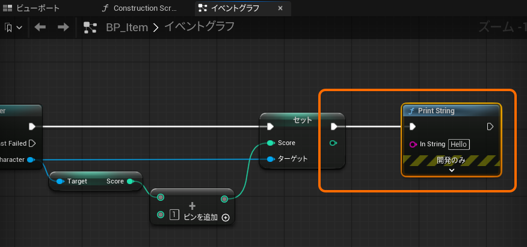
    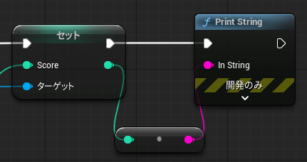
    1. `Set Score` ノードの右側の**実行ピン**をドラッグし、空白で離し、「**Print String**」ノードを検索して配置します
    2. `Set Score` ノードの右側の**出力ピン**（緑のピン）を `Print String` の **「In String」ピン**（紫のピン）にドラッグしてつなぎます（整数→文字列の変換ノードが自動で追加されます）
    3. 「**コンパイル**」をクリックして緑のチェックになることを確認します

全体的に次のようになっていればOKです。


#### テストプレイで確認する

メインエディタに戻ってプレイ（▶）して、アイテムに触れてみましょう。

**→ 触れるたびに画面左上のスコアが「1」「2」「3」... と表示が増えていけば成功です。**

#### Print String を削除する

確認できたら Print String ノードと、自動追加された変換ノードを削除します。

1. `Print String` ノードをクリックして選択し、**Delete キー**を押して削除します
2. `Print String` の手前に自動追加された **「緑から紫」の変換ノード** も同様にクリックして **Delete キー**で削除します
3. 「**コンパイル**」をクリックして緑のチェックになることを確認します

---

### 3-5. アイテムを消す（Destroy Actor）

スコアが増えることを確認できました。次にアイテムを消す処理を追加します。
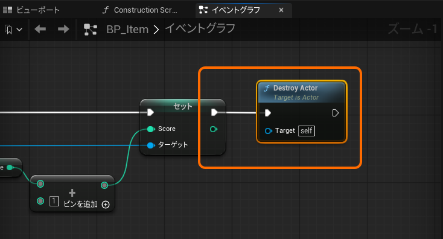
1. `Set Score` ノードの右側の**実行ピン**をドラッグして、空白で離し、「**Destroy Actor**」ノードを検索して配置します
2. 「**コンパイル**」をクリックして緑のチェックになることを確認します

---

### 3-6. テストプレイで確認する

メインエディタに戻ってプレイ（▶）して、アイテムに触れてみましょう。

**→ アイテムが消えれば成功です。**

---

Step 3 のブループリントのイベントグラフ全体は次のようになります。

<iframe src="https://blueprintue.com/render/ofzxd0jx/" width="100%" height="400" scrolling='no' allowFullScreen></iframe>

:::tip[Step 3 確認ポイント]
- アイテムに触れるとスコアが増える
- アイテムに触れると消える
:::

---

## Step 4：アイテムを全部集めたらクリアにする（55〜70分）

このステップが終わると、アイテムを 5 個すべて集めた瞬間に画面に「CLEAR!」と表示されるゲームが完成します！

アイテムを取るたびにスコアが 1 増える仕組みはもう作ってあります。最後の 1 個を取ってスコアが 5 になった瞬間に「CLEAR!」を出すために、`BP_Item` の Blueprint に**条件分岐**を追加します。

---

**追加するノードの流れ（BP_Item）：**

```
（Step 3で作った）[Set Score]
        ↓
（Step 3で作った）[Destroy Actor]
        ↓  ← ここに新しくつなぐ
[Branch（分岐）]  ← Condition: 新しいスコア >= 5
        ↓ True
[Print String "CLEAR!"]
```

---

### 4-1. BP_Item にクリア判定を追加する

Step 3 で作ったノードの続きに追加していきます。
1. スコアが5以上のときだけ特定の処理を行えるようにします。
    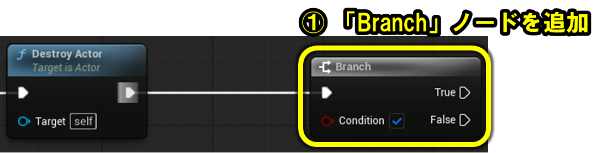
    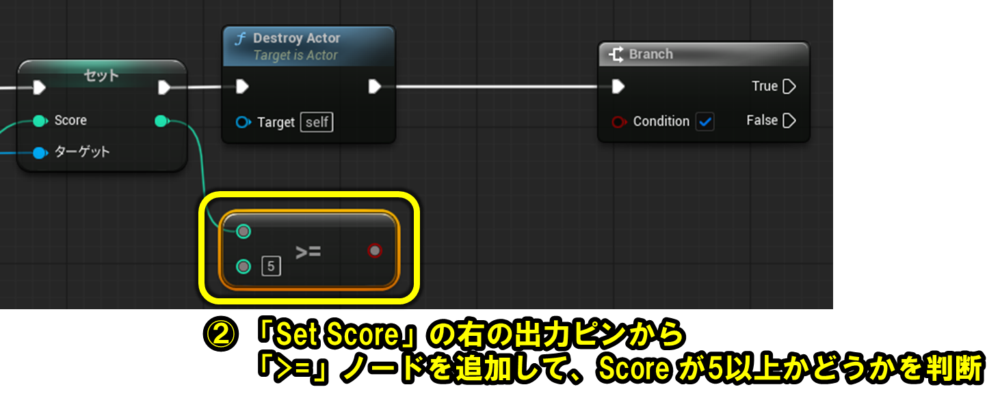
    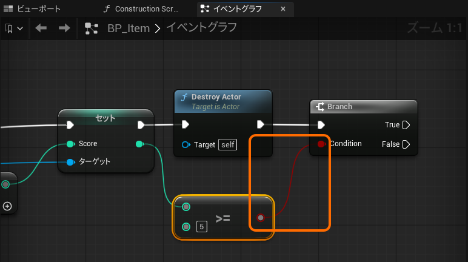
    1. `Destroy Actor` の右側の**実行ピン**をドラッグして、空の場所で離し、「**Branch**」ノードを検索して配置します
    2. `Set Score` の右側の**Score 出力ピン**（緑のピン）をドラッグして、空の場所で離し、「**>=**」を検索して配置し、`>=` ノードの下側の入力に直接「**5**」を入力します。
    3. `>=` ノードの右側の**出力ピン**（赤いピン）を `Branch` ノードの左側の「**Condition**」ピン（赤いピン）につなぎます
2. あとは、スコアが5以上であるときに、**CLEAR! メッセージ** を出すようにしましょう。
    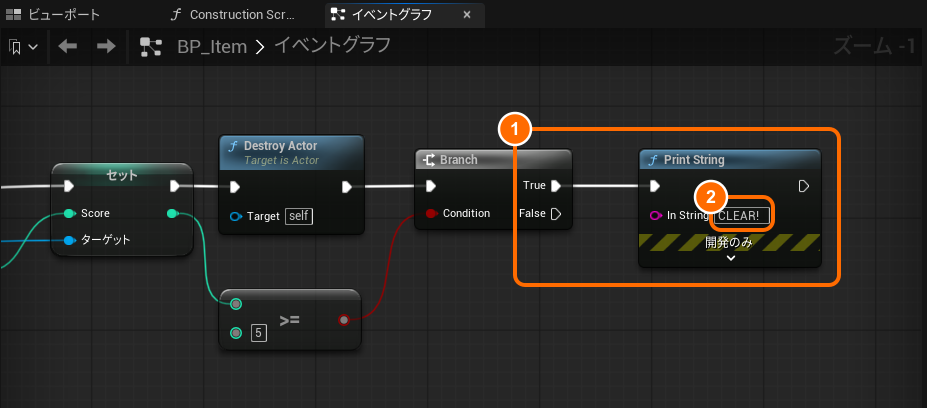
    1. `Branch` ノードの「**True**」実行ピンをドラッグして、空の場所で離し、「**Print String**」ノードを検索して配置します
    2. `Print String` ノードの「**In String**」欄に「**CLEAR!**」と入力します
3. 「**コンパイル**」をクリックしてアイコンが**緑のチェック**になることを確認します

全体として、`Set Score` ノードから右側が次のようになっていればOKです。

<iframe src="https://blueprintue.com/render/lxxevqg_/" width="100%" height="400" scrolling="no" allowFullScreen></iframe>

---

### 4-2. テストプレイで確認する

メインエディタに戻ってプレイ（▶）して、アイテムを 2〜3 個取ってみましょう。

**→ CLEAR! が表示されないことを確認してから、残りのアイテムをすべて取ります。5 個目を取った瞬間に、次のように画面左上に小さく水色で「CLEAR!」と表示されれば成功です！**

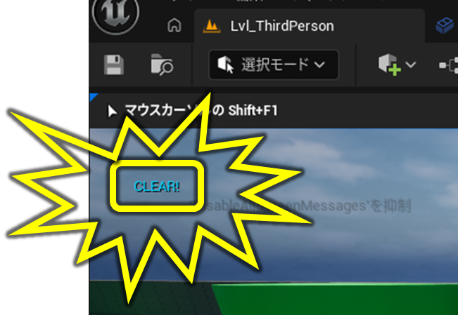

:::tip[Step 4 確認ポイント]
- アイテムを 1〜4 個取っても CLEAR! が表示されない
- 5 個目を取った瞬間に「CLEAR!」と表示される
:::

---

### 演習：クリア条件を変えてみよう

<Exercise>

CLEAR! が出る個数を変えてみましょう。

1. クリア判定の `>=` ノードの下側入力を「**3**」に変えてプレイしてみます
2. 3 個集めると CLEAR! が出ることを確認します
3. 確認できたら「**5**」に戻しておいてください

</Exercise>

---

## 振り返り

あなたが今日作ったゲームには、3 つの重要な考え方が使われています。

| 仕組み | 今日の使い方 |
|---|---|
| **イベント** | 「何かに触れたとき」に処理を開始する |
| **変数** | スコアをゲームの中で記憶する |
| **条件分岐** | 「スコアが足りているかどうか」で処理を分ける |

この 3 つはどんなゲームにも、ゲーム以外のアプリにも共通して出てきます。

---

## 発展演習：ゲームをカスタマイズしよう

早く終わって時間が余ったら行う演習です。好きなものを選んで挑戦してください。

### 演習-発展1：アイテムを増やしてゲームを再設計する

<Exercise>

現在はアイテムが 5 個あります。10 個に増やし、クリア条件を 8 個に変えてみましょう。

<Solution>

- コンテンツブラウザから `BP_Item` をレベルにドラッグして 5 個追加する
- `BP_Item` を開き、`>=` ノードの右側入力を「8」に変更してコンパイル・保存する

</Solution>
</Exercise>

### 演習-発展2：クリアメッセージを自分の言葉に変える

<Exercise>

「CLEAR!」というテキストを自分の好きなメッセージに変えてみましょう。

<Solution>

1. `BP_Item` の Blueprint エディタを開きます
2. クリア判定の `Print String` ノードの「**In String**」欄を好きなメッセージに変更します
3. 「**コンパイル**」→「**保存**」をクリックします

</Solution>
</Exercise>

### 演習-発展3：アイテムの形を変える

<Exercise>

現在のアイテムは白いキューブです。Sphere（球）など別の形に変えてみましょう。

<Solution>

1. コンテンツブラウザで `BP_Item` をダブルクリックして Blueprint エディタを開く
2. コンポーネントパネルで「StaticMesh」を選択する
3. 詳細パネルの「Static Mesh」を別のメッシュに変更する（Sphere, Cylinder, Cone などが選べます）

</Solution>
</Exercise>

### 演習-発展4：ゴールの見た目をわかりやすくする

<Exercise>

プレイヤーがゴールをすぐ見つけられるように、見た目を目立たせてみましょう。

<Solution>

- `BP_Goal` の Blueprint を開き、StaticMesh コンポーネントを選択して詳細パネルの「Materials」欄から色のついたマテリアルを設定する
- Box Collision の位置や大きさを、見た目に合わせて調整する

</Solution>
</Exercise>

### 演習-発展5（上級）：スコアをゲーム中に画面表示する

<Exercise>

現在はスコアがいくつかを画面で確認できません。スコアをリアルタイムで表示してみましょう。

<Solution>

1. `WBP_Clear` と同じ手順で、新しい Widget Blueprint「`WBP_HUD`」を作成する
2. テキストブロックを追加して、テキストの「Bind（バインド）」ボタンから `Score` 変数を参照する
3. ゲーム開始時（`BP_ThirdPersonCharacter` の `Event Begin Play` ノード）に `WBP_HUD` を `Add to Viewport` で表示する

</Solution>
</Exercise>

---

お疲れ様でした！ゲームを完成させてくれてありがとうございます。

あなたが今日作ったゲームには、「**イベント**」「**変数**」「**条件分岐**」という 3 つの仕組みが入っています。この 3 つはどんなゲームにも使われる基本です。**ここからルールを1つ増やすたびに、作れるゲームの幅がどんどん広がっていきます。**
