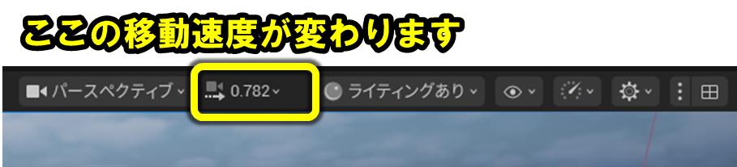
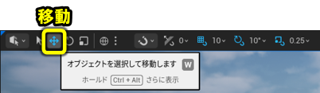
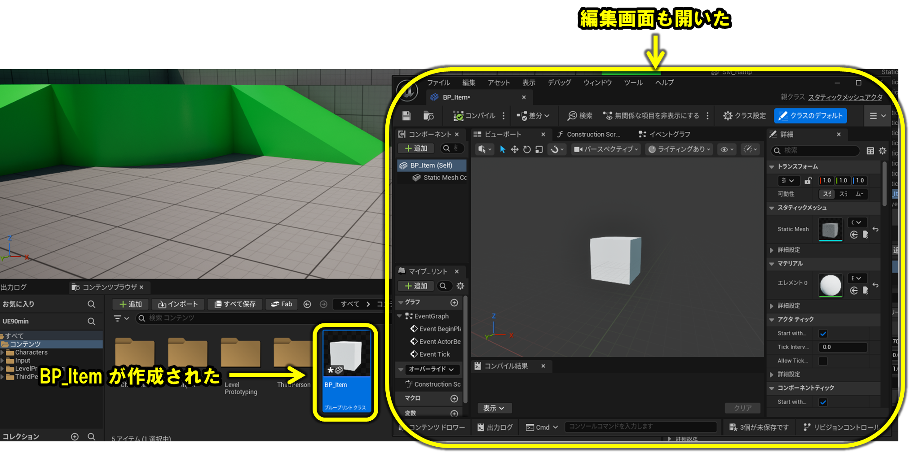
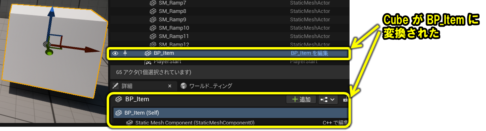
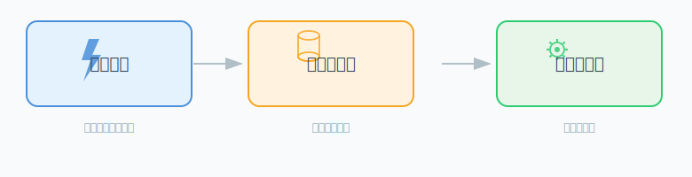
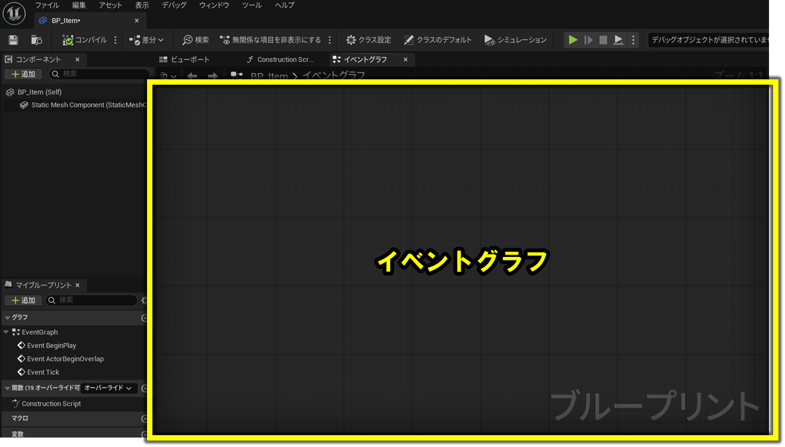
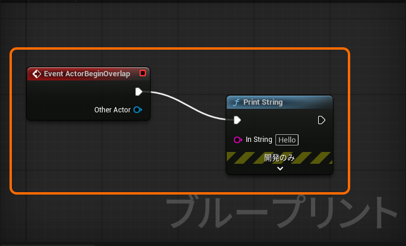
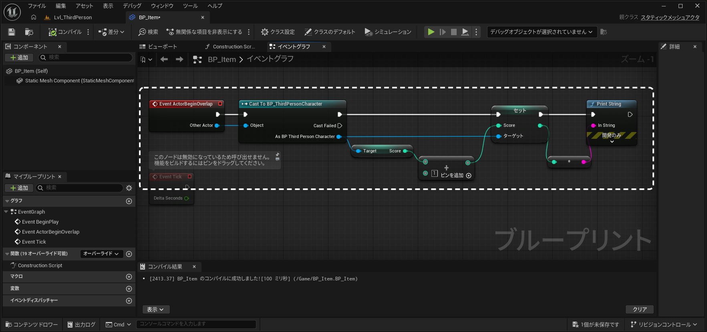

import projectZipUrl from './assets/UE90min.zip'

ここから実際に手を動かして作っていきます。

このページの手順をひとつずつ進めれば、最後にはキャラクターが動いてアイテムを集めてクリアになるゲームが完成します。わからなくなったら、今どのステップにいるかをこのページで確認してから講師に声をかけてください。

**今日完成させるもの：**

| 機能 | 内容 |
|---|---|
| キャラクター操作 | WASD で移動、Space でジャンプ |
| アイテム取得 | 触れたら消えてスコアが 1 増える |
| クリア条件 | 5 個集めると画面に「CLEAR!」と表示される |

<Section title="Step 1：プロジェクトを作って動かす（0〜15分）" goal="キャラクターを自分で動かせるようになります">

<Reference title="1-1・1-2 を省略してプロジェクトファイルから始める">

プロジェクトの作成にあまりに長時間かかる場合は、こちらのプロジェクトファイルを使えます。

<DownloadLink file={projectZipUrl} filename="UE90min.zip">UE90min.zip をダウンロード</DownloadLink>

zip を展開して、中の `UE90min.uproject` をダブルクリックしてプロジェクトを開き、**1-3 から**始めてください。

</Reference>

<Section title="1-1. Unreal Engine 5.7 を起動する" goal="Unreal Engine 5.7 が起動し、プロジェクト選択画面（Unreal Project Browser）が表示された状態">

<Action img="./img/startup.png">
  **Unreal Engine 5.7** を起動します
</Action>

</Section>

<Section title="1-2. テンプレートを選ぶ" goal="移動・ジャンプ・カメラが最初から動く三人称テンプレートで開始した状態">

<Action img="./img/newproject.png">
  左側から「**新規プロジェクト**」を押して、「新規プロジェクト」ウィンドウを開きます
</Action>

<Action img="./img/newproject-settings.png">
  次のように設定してから「**作成**」をクリックします

  | 設定項目 | 選択する値 |
  |---|---|
  | カテゴリ | **ゲーム** |
  | テンプレート | **三人称** |
  | ブループリント/C++ | **ブループリント** |
  | ターゲット プラットフォーム | **Desktop** |
  | 品質プリセット | **Maximum** |
  | バリアント | **なし** |
  | 保存先 | **デスクトップ** |
  | プロジェクト名 | **UE90min** |
</Action>

<Action img="./img/unrealeditor.png">
  読み込みが完了すると、Unreal Engine のメイン画面が開きます（数分かかることがあります）
</Action>

<Verify>メイン画面が開けば起動成功です。</Verify>

</Section>

<Section title="1-3. プレイして動かしてみる" goal="WASD / Space でキャラクターを操作できる状態">

<Action img="./img/play-in-editor.png">
  上部ツールバーの**緑の「▶ プレイ」ボタン**をクリックして、ビューポートの中を**クリック**します（クリックでカーソルが消えて、ゲーム操作が有効になります）
</Action>

<Recovery title="操作できないとき">
再生後は必ずビューポートを 1 回クリックします。クリックしないとキー入力がゲームに届きません。
</Recovery>

<Action>
  次のキーでキャラクターを動かしてみましょう

  | キー | 動作 |
  |---|---|
  | **W / A / S / D** | 前後左右に移動 |
  | **Space** | ジャンプ |
  | **マウスの移動** | カメラの向きを変える |
</Action>

<Action>
  確認できたら **Esc を押してプレイを終了**します
</Action>

<Verify>W/A/S/D でキャラクターが動き、Space でジャンプできれば成功です。</Verify>

</Section>

<Checkpoint>

- W/A/S/D でキャラクターが動く
- Space でジャンプできる
- Esc でプレイを終了できる

</Checkpoint>

<Section title="演習：アイテムをどこに置くか計画しよう">

<Exercise>

プレイしながら、**アイテムを置きたい場所を 5 か所**見つけてみましょう。次のステップで実際にそこへ置きます。

場所を選ぶときの条件：
- 走ってすぐ取れる「楽な場所」を 2〜3 か所
- ジャンプが必要な「少し難しい場所」を 1〜2 か所
- 実際に足で立てること（壁の中・床の下はNG）

5 か所決まったら Esc でプレイを終了してください。

<Solution>

置き場所の例：

- 楽な場所：スタート地点の近く、平らな床の上
- 難しい場所：ステージ中央の台の上、端の高台

ゲームとしておもしろいのは、**どれも取れるけど全部が同じ難易度ではない**配置です。次のステップでこの計画を実現していきましょう。

</Solution>
</Exercise>

</Section>

</Section>

<Section title="Step 2：アイテムを作って配置する（10〜30分）" goal="ステージの上に取れるアイテムが並んだ状態になります">

<Reference title="画面の見方">

手順でよく出てくるパネル名です。

| パネル名 | 場所 | 役割 |
|---|---|---|
| **メインビューポート** | 中央 | 3Dシーンを表示・編集する作業台 |
| **アウトライナー** | 右上 | シーンにある全オブジェクトの一覧 |
| **詳細パネル** | 右下 | 選択中のオブジェクトの設定を表示・変更 |
| **コンテンツブラウザ** | 下部 | プロジェクトのファイルをフォルダで管理 |

</Reference>

<Reference title="こまめに保存しましょう">

作業中は **Ctrl + Shift + S**（すべて保存）を使ってこまめに保存しましょう。
保存しないと、万が一のトラブルで作業が消えてしまうことがあります。

</Reference>

<Reference title="ビューポートのカメラ移動">

編集中にビューポートの視点を動かしたいときは次の操作を使います。

| 操作 | 動作 |
|---|---|
| **右クリック + ドラッグ** | カメラの向きを変える |
| **右クリック中に W / A / S / D** | 前後左右に移動 |
| **右クリック中に Q / E** | 下・上に移動 |
| **右クリック中にマウスホイール** | 移動速度を変える（上で加速・下で減速） |

プレイ中のキャラクター操作とは別の操作です。**右クリックを押しながら**動かすのがポイントです。

</Reference>

<Section title="2-1. キューブをステージに置く" goal="歩いて触れる位置に 1 つのキューブが置かれた状態">

<Action img="./img/place-cube.png">
  「キューブに+」のアイコン → 「形状」へカーソルを乗せ → 「**キューブ**」をビューポートにドラッグ＆ドロップして配置します
</Action>

<Action img="./img/how-to-translate-with-translation-gizmo.png">
  配置したキューブを**クリックして選択**し（オレンジの枠が付きます）、矢印をドラッグして歩いて触れる高さに移動します
</Action>

<Recovery title="矢印（移動ギズモ）が表示されないとき">
キューブを選択して **W キー** を押すか、 をクリックして移動モードに切り替えてください。
</Recovery>

<Action img="./img/cube-positioned-low-enough-to-touch.png">
  最終的にこのくらいの高さになっていれば OK です
</Action>

<Verify>ビューポート上のキューブが、キャラクターに触れられる高さに置かれていれば配置完了です。</Verify>

</Section>

<Section title="2-2. 動作確認" goal="今のキューブはただの 3D 物体で何も起きないことを確認する">

<Action>
  プレイ（▶）して、キャラクターをキューブに近づけます
</Action>

<Action>
  確認できたら Esc でプレイを終了します
</Action>

<Verify>キャラクターがキューブにぶつかって止まるだけで、何も起きません。</Verify>

</Section>

今のキューブはただの 3D の物体です。「触れたら何かする」という仕組みがまだ入っていないので、何も起きません。次のステップでこのキューブに仕組みを追加できるようにしていきます。

<Section title="2-3. キューブを Blueprint クラスに変換する" goal="キューブが BP_Item という Blueprint クラスになる">

<Concept title="Blueprint クラスとは">

Unreal Engine でオブジェクトに「触れたら消える」「スコアが増える」といった動作を設定するには、**Blueprint クラス**にする必要があります。

Blueprint クラスにすると、同じ設定を持つコピーを何個でも簡単に作れます。1 個設定すれば 5 個に増やせる、というわけです。

</Concept>

<Action img="./img/convert-to-blueprint-process.png">
  ビューポートでキューブを**クリックして選択**し、詳細パネルの「**ブループリントクラスへの変換**」ボタンを押します
</Action>

<Concept title="「BP_」プレフィックスの意味">

この後のダイアログでは、ブループリント名を **BP_Item** にします。ファイル名の先頭に「BP_」を付けるのは、一覧を見たときに「これは Blueprint だ」とすぐわかるようにするための慣習です。

</Concept>

<Action img="./img/convert-to-blueprint-window-process.png">
  次のように設定して「**選択**」をクリックします

  | 設定項目 | 選択する値 |
  |---|---|
  | 作成方法 | **そのまま**（新しいサブクラス） |
  | 親クラス | **そのまま**（StaticMeshActor） |
  | ブループリント名 | **BP_Item** |
  | パス | **そのまま**（/All/Game） |
</Action>

<Verify>`BP_Item` という Blueprint ファイルが作成され、編集画面も開きます。</Verify>

<Reference title="変換後の状態">




</Reference>

<Action img="./img/close-BP_Item-editor-window.png">
  自動的に開いた `BP_Item` の編集画面は今は使いません。タブの「**×**」をクリックして閉じてください。
</Action>

</Section>

<Section title="2-4. BP_Item をレベルに 5 つ配置する" goal="ステージ上に BP_Item が 5 個配置された状態">

<Action img="./img/five-cubes-in-level.png">
  画面下部の**コンテンツブラウザ**から「**BP_Item**」をビューポートにドラッグ＆ドロップで、合計 5 つになるように様々な場所に配置します（下の画像とは違う場所に置いてみましょう）
</Action>

:::tip[配置のヒント]
「すぐ取れる楽な場所」と「ジャンプが必要な少し難しい場所」を混ぜると、ゲームとして面白くなります。
壁や床の中に完全に埋まって取れなくなってしまう場所には置かないようにしましょう。
置けたら、プレイして実際に歩いて全部触れるか確認してみましょう。
:::

</Section>

<Checkpoint>

- ステージ上（またはアウトライナー）に「BP_Item」が 5 つある

</Checkpoint>

</Section>

<Section title="Step 3：触れたら消えてスコアが増えるようにする（30〜55分）" goal="アイテムに触れるたびにアイテムが消えてスコアが増えるようになります">

<Concept title="このステップで作る 2 つの仕組み">

どちらか片方だけ設定してもゲームとして成り立ちません。両方を一緒に作ります。

| 仕組み | 片方だけ設定するとどうなる？ |
|---|---|
| **アイテムが消える** | スコアは増えない |
| **スコアが 1 増える** | アイテムが消えない（何度でも取れてしまう） |

</Concept>

<Concept title="ゲームの仕組みの基本形">

ゲームはこの基本形の積み重ねで動いています。

**「何かが起きたら（イベント）→ 状態が変わる（変数の更新）→ 結果が出る（アクション）」**



スコアは「プレイヤーが何個アイテムを取ったか」を表す数値で、ゲーム内の「**変数**」として記憶させます。

</Concept>

<Section title="3-1. プレイヤーキャラクターに Score 変数を追加する" goal="BP_ThirdPersonCharacter に Integer 型の Score 変数が追加された状態">

スコアを記録する「変数」を作ります。**変数はゲームの状態を記憶する入れ物**です。

<Concept title="変数はどこに作る？">

変数はどの Blueprint にでも作れます。ただし、その変数を「誰が持つのか」を考えて置き場所を決める必要があります。

スコアは「このプレイヤーが何個取ったか」という情報なので、**プレイヤーキャラクターの Blueprint（BP_ThirdPersonCharacter）** に作るのが自然です。アイテム（BP_Item）に置くと、「それぞれのアイテムが別々のスコアの入れ物を持つ」ことになるため、データを保持しにくくなります。
プレイヤーであればゲーム中は常に存在するので、途中で消えたりしてスコアが消える心配もありません。

</Concept>

<Concept title="変数の型について">

変数は「何かを入れておける入れ物」ですが、入れ物ごとに **入れられるものの種類（型）** が決まっています。

| 型 | 入れられるもの | 使いどころ |
|---|---|---|
| **Integer（整数）** | 1, 2, 3 … | スコア、個数、残機など |
| **Boolean（ブーリアン）** | True / False | フラグ、オン/オフの状態など |
| **String（文字列）** | "Hello" … | 名前、メッセージなど |

今回のスコアは「1個取った」「2個取った」のように**整数で十分**なので、Integer を選びます。

</Concept>

<Action img="./img/how-to-open-BP_ThirdPersonCharacter.png">
  コンテンツブラウザで **コンテンツ → ThirdPerson → Blueprints** フォルダを開き、「**BP_ThirdPersonCharacter**」をダブルクリックします
</Action>

<Action img="./img/add-Score-variable.png">
  左側「**マイブループリント**」パネルの「**変数**」セクション右の「**＋**」をクリックして、名前を「**Score**」、型を「**Integer**」にします
</Action>

<Action>
  タブの「**×**」をクリックして BP_ThirdPersonCharacter の編集画面を閉じます
</Action>

</Section>

<Section title="3-2. BP_Item のコリジョン設定を変える" goal="プレイヤーが BP_Item をすり抜けて通れる状態">

<Concept title="コリジョンとは">

**コリジョン（Collision）** とは、オブジェクト同士が「ぶつかった・触れた」ことをゲームが認識するための当たり判定のことです。

| 種類 | 動作 | 使いどころ |
|------|------|-----------|
| **ブロック** | 相手をはじいて通れなくする | 壁・床・障害物 |
| **オーバーラップ** | すり抜けられる＋触れたことだけ通知する | アイテム・ゴールゾーン |

BP_Item は元キューブなので初期設定は「ブロック」です。「オーバーラップ」に変えることで、すり抜けつつ触れた瞬間を検知できるようになります。

</Concept>

<Action img="./img/how-to-BP_Item_OverlapAllDynamic.png">
  コンテンツブラウザで「**BP_Item**」をダブルクリックして Blueprint エディタを開き、「コリジョン」で検索して「**Generate Overlap Events**」をオンにし、「**コリジョンプリセット**」を「**OverlapAllDynamic**」に変更します
</Action>

<Verify>詳細パネルの **コリジョンプリセット** が **OverlapAllDynamic** になっていれば設定完了です。</Verify>

</Section>

<Section title="3-3. Overlap イベントで動作確認する" goal="アイテムに触れると画面に「Hello」が表示される状態">

アイテムに触れたとき、画面に「Hello」という文字が表示されるようにします。まずこれで「**触れたことを検知する**」仕組みの作り方を学びます。

<Action img="./img/open-full-blueprint-editor-button.png">
  「**フルブループリントエディタを開く**」ボタンをクリックします
</Action>

<Concept title="イベントグラフとは">



黄色枠の部分がイベントグラフです。ここにノードを配置したりつなげたりして**ゲームの仕組みを書いていきます**。

</Concept>

<Reference title="イベントグラフの操作">

| キー / 操作 | 動作 |
|---|---|
| **右クリック + ドラッグ** | グラフをスクロール（パン） |
| **マウスホイール** | ズームイン／アウト |
| **Home キー** | 全ノードが画面に収まるように表示を合わせる |

ノードが見つからないときは Home キーで全体表示に戻りましょう。

</Reference>

<Concept title="Event ActorBeginOverlap と Print String">

- **Event ActorBeginOverlap**：「何かが触れた瞬間」に起動するノードです。
- **Print String**：指定した文字を画面に表示するノードで、仕組みが正しく動いているかを手軽に確認するために使います。

</Concept>

<Action img="./img/node-Event%20ActorBeginOverlap.png">
  グラフ内で `Event ActorBeginOverlap` と書かれたノードを探します
</Action>

<Action img="./img/add-print-string-node-from-actorbeginoverlap.png">
  **実行ピン（白い矢印）** をドラッグして空白で離し、「**Print String**」を検索して **Enter キー** で追加します
</Action>

<Concept title="「コンパイル」とは">

**作ったノードの設定をゲームが実際に動かせる形に変換する作業**です。アイコンが緑のチェック → 成功、赤の × → エラーあり。ノードを組み終わったら一度押してアイコンを確認する習慣をつけておくと、問題を早く発見できます。

</Concept>

<Action img="./img/compile-BP_Item-and-check-result.png">
  「**コンパイル**」をクリックして、アイコンが**緑のチェック**になることを確認します
</Action>

<Reference title="ここまでの完成状態">



</Reference>

<Action>
  メインエディタに戻ってプレイ（▶）して、キャラクターをアイテムに触れさせます
</Action>

<Action img="./img/print-string-Hello-in-viewport.png">
  触れると、画面左上にこのように「Hello」と表示されます
</Action>

<Verify>水色で「Hello」と表示されれば成功です。</Verify>

<Concept title="なぜ「Hello」が表示されたのか">


**Event ActorBeginOverlap** が「触れた瞬間」を起点にして処理を起動し、そこにつないだ **Print String** が「Hello」を画面に表示した、という流れです。「**何かが起きたら → つないだ先の処理が順番に動いていく**」というのが Blueprint の基本の流れで、次のステップではこの Print String の代わりに「スコアを増やす」「アイテムを消す」処理をつないで本番のゲームにしていきます。

</Concept>

<Action>
  `Print String` ノードをクリックして選択し、**Delete キー**を押して削除します
</Action>

<Action>
  「**コンパイル**」をクリックして緑のチェックになることを確認します
</Action>

</Section>

<Section title="3-4. Blueprint ロジックを組む" goal="触れたらスコアが +1 されるロジックがイベントグラフ上に組まれた状態">

本番の「触れたらスコアを増やし、アイテムを消す」ロジックを組みます。

**完成形のノードの流れ：**

```
[Event ActorBeginOverlap]
        ↓ (実行)
[Cast To BP_ThirdPersonCharacter]  ← "Other Actor" ピンを接続
        ↓ (Cast Succeeded)
[Set Score]  ← 現在の Score + 1 を入力  【スコアを増やす】
        ↓
[Destroy Actor]                             【アイテムを消す】
```

<Section title="(a) Cast ノードを追加する" goal="触れたオブジェクトがプレイヤーかを判定するノードがつながった状態">

<Action img="./img/Event%20ActorBeginOverlap-Cast%20To%20BP_ThirdPersonCharacter-searching.png">
  `Event ActorBeginOverlap` の**Other Actor（青いピン）**をドラッグして空の場所で離し、「**Cast To BP_ThirdPersonCharacter**」を検索して配置します
</Action>

<Action img="./img/Event%20ActorBeginOverlap-Cast%20To%20BP_ThirdPersonCharacter.png">
  配置後の接続状態を確認します
</Action>

</Section>

<Section title="(b) 現在のスコアを取得して 1 を加算する" goal="Score + 1 を計算する Add ノードがつながった状態">

<Action img="./img/GetScore-from-BP_ThirdPersonCharacter.png">
  `Cast To BP_ThirdPersonCharacter` の「**As BP Third Person Character**」ピン（青）をドラッグして空の場所で離し、「**Get Score**」を配置します
</Action>

<Action img="./img/AddScore.png">
  「Get Score」の「**Score**」ピン（緑）をドラッグして空の場所で離し、「**Add（+）**」を配置します（「**+**」で検索できます）
</Action>

<Action img="./img/Add1-to-Score.png">
  `+` ノードの下側の入力に「**1**」を直接入力します
</Action>

</Section>

<Section title="(c) 計算した値で Score 変数を更新する" goal="Set Score ノードに新しい値が流れ込む状態">

<Action img="./img/search-set-score-from-BP_ThirdPersonCharacter.png">
  もう一度 `Cast To BP_ThirdPersonCharacter` の「**As BP Third Person Character**」ピンをドラッグして空の場所で離し、「**Set Score**」を配置します（`+` ノードの右側に移動すると読みやすくなります）
</Action>

<Action img="./img/connect-Score%2B1-SetScore.png">
  `+` ノードの**出力ピン**を `Set Score` の **Score 入力ピン**につなぎます
</Action>

<Action img="./img/connect-CastToBP_ThirdPersonCharacter-SetScore.png">
  `Cast To BP_ThirdPersonCharacter` の**上の実行ピン**（白）を `Set Score` の**実行ピン**につなぎます
</Action>

</Section>

<Section title="(d) 動作確認用の Print String をつないで増分を確認する" goal="プレイ中にスコアの増分が画面で確認できる状態">

<Action img="./img/print-string-from-set-score.png">
  `Set Score` の**実行ピン**をドラッグして、「**Print String**」を配置します
</Action>

<Action img="./img/connect-setscore-and-printstring.png">
  `Set Score` の**出力ピン**（緑）を `Print String` の「**In String**」ピン（紫）につなぎ、「**コンパイル**」をクリックして緑のチェックになることを確認します
</Action>

<Reference title="ここまでの完成状態">



</Reference>

<Action>
  メインエディタに戻ってプレイ（▶）して、アイテムに触れます
</Action>

<Verify>触れるたびに画面左上のスコアが「1」「2」「3」... と増えていけば成功です。</Verify>

</Section>

<Section title="(e) 動作確認用ノードを片付ける" goal="動作確認用の Print String と変換ノードが削除された状態">

<Action>
  `Print String` ノードをクリックして選択し、**Delete キー**を押して削除します
</Action>

<Action>
  手前に自動追加された**「緑から紫」の変換ノード**も同様に選択して **Delete キー**で削除します
</Action>

<Action>
  「**コンパイル**」をクリックして緑のチェックになることを確認します
</Action>

</Section>

</Section>

<Section title="3-5. アイテムを消す（Destroy Actor）" goal="スコア加算後にアイテム自体も消えるロジックが完成した状態">

<Action img="./img/add-destroy-actor-node.png">
  `Set Score` の**実行ピン**をドラッグして、「**Destroy Actor**」を配置し、「**コンパイル**」をクリックして緑のチェックになることを確認します
</Action>

</Section>

<Section title="3-6. テストプレイで確認する" goal="アイテムに触れるとスコアが増えてアイテムが消えることを確認できた状態">

<Action>
  メインエディタに戻ってプレイ（▶）して、アイテムに触れます
</Action>

<Verify>アイテムが消えれば成功です。</Verify>

</Section>

<Reference title="Step 3 完成形：イベントグラフ全体">

<iframe src="https://blueprintue.com/render/ofzxd0jx/" width="100%" height="400" scrolling='no' allowFullScreen></iframe>

</Reference>

<Checkpoint>

- アイテムに触れるとスコアが増える
- アイテムに触れると消える

</Checkpoint>

</Section>

<Section title="Step 4：アイテムを全部集めたらクリアにする（55〜70分）" goal="アイテムを 5 個すべて集めた瞬間に画面に「CLEAR!」と表示されるゲームが完成します">

アイテムを取るたびにスコアが 1 増える仕組みはもう作ってあります。最後の 1 個を取ってスコアが 5 になった瞬間に「CLEAR!」を出すために、`BP_Item` の Blueprint に**条件分岐**を追加します。

**追加するノードの流れ（BP_Item）：**

```
（Step 3 で作った）[Set Score]
        ↓
（Step 3 で作った）[Destroy Actor]
        ↓  ← ここに新しくつなぐ
[Branch（分岐）]  ← Condition: 新しいスコア >= 5
        ↓ True
[Print String "CLEAR!"]
```

<Section title="4-1. BP_Item にクリア判定を追加する" goal="スコアが 5 以上のときに CLEAR! を表示する分岐がイベントグラフに組まれた状態">

<Concept title="Branch（条件分岐）とは">

**Branch** は、**Condition（条件）** が `True` なら **True** 側の処理へ、`False` なら **False** 側の処理へ進むためのノードです。

今回は「**Score が 5 以上か？**」を Condition にして、`True` のときだけ `CLEAR!` を表示します。比較には「**>=**（以上）」ノードを使い、**Score** と **5** を比べて `True` / `False` を返してもらいます。

</Concept>

<Action img="./img/add-branch-after-destroy-actor.png">
  `Destroy Actor` の**実行ピン**をドラッグして、「**Branch**」ノードを配置します
</Action>

<Action img="./img/is-score-greater-than-or-euqal-to-5.png">
  `Set Score` の**Score 出力ピン**（緑）をドラッグして、「**>=**」ノードを配置し、下側の入力に「**5**」を入力します
</Action>

<Action img="./img/connect-is-score-clear-to-branch-condition.png">
  `>=` の**出力ピン**（赤）を `Branch` の「**Condition**」ピン（赤）につなぎます
</Action>

<Action img="./img/add-clear-message-print-string.png">
  `Branch` の「**True**」実行ピンをドラッグして「**Print String**」を配置し、「**In String**」欄に「**CLEAR!**」と入力します
</Action>

<Action>
  「**コンパイル**」をクリックしてアイコンが**緑のチェック**になることを確認します
</Action>

<Reference title="Set Score ノードから右側の完成形">

<iframe src="https://blueprintue.com/render/lxxevqg_/" width="100%" height="400" scrolling="no" allowFullScreen></iframe>

</Reference>

</Section>

<Section title="4-2. テストプレイで確認する" goal="5 個目のアイテムを取った瞬間に「CLEAR!」が表示されることを確認した状態">

<Action>
  メインエディタに戻ってプレイ（▶）して、アイテムを 2〜3 個取ります（CLEAR! が表示されないことを確認します）
</Action>

<Action>
  残りのアイテムをすべて取ります
</Action>

<Action img="./img/print-string-clear-result.png">
  5 個目を取ると、画面左上にこのように「CLEAR!」と表示されます
</Action>

<Verify>「CLEAR!」が表示されれば完成です！</Verify>

</Section>

<Checkpoint>

- アイテムを 1〜4 個取っても CLEAR! が表示されない
- 5 個目を取った瞬間に「CLEAR!」と表示される

</Checkpoint>

<Section title="演習：クリア条件を変えてみよう">

<Exercise>

CLEAR! が出る個数を変えてみましょう。

1. クリア判定の `>=` ノードの下側入力を「**3**」に変えてプレイしてみます
2. 3 個集めると CLEAR! が出ることを確認します
3. 確認できたら「**5**」に戻しておいてください

</Exercise>

</Section>

</Section>

## 振り返り

あなたが今日作ったゲームには、3 つの重要な考え方が使われています。

| 仕組み | 今日の使い方 |
|---|---|
| **当たり判定（イベント）** | 「何かに触れたとき」に処理を開始する |
| **変数** | スコアをゲームの中で記憶する |
| **条件分岐** | 「スコアが足りているかどうか」で処理を分ける |

この 3 つはどんなゲームにも、ゲーム以外のアプリにも共通して出てきます。

## 発展演習：ゲームをカスタマイズしよう

早く終わって時間が余ったら行う演習です。好きなものを選んで挑戦してください。

### 演習-発展1：アイテムを増やしてゲームを再設計する

<Exercise>

現在はアイテムが 5 個あります。10 個に増やし、クリア条件を 8 個に変えてみましょう。

<Solution>

- コンテンツブラウザから `BP_Item` をレベルにドラッグして 5 個追加する
- `BP_Item` を開き、`>=` ノードの右側入力を「8」に変更してコンパイル・保存する

</Solution>
</Exercise>

### 演習-発展2：クリアメッセージを自分の言葉に変える

<Exercise>

「CLEAR!」というテキストを自分の好きなメッセージに変えてみましょう。

<Solution>

1. `BP_Item` の Blueprint エディタを開きます
2. クリア判定の `Print String` ノードの「**In String**」欄を好きなメッセージに変更します
3. 「**コンパイル**」→「**保存**」をクリックします

</Solution>
</Exercise>

### 演習-発展3：アイテムの形を変える

<Exercise>

現在のアイテムは白いキューブです。Sphere（球）など別の形に変えてみましょう。

<Solution>

1. コンテンツブラウザで `BP_Item` をダブルクリックして Blueprint エディタを開く
2. コンポーネントパネルで「StaticMesh」を選択する
3. 詳細パネルの「Static Mesh」を別のメッシュに変更する（Sphere, Cylinder, Cone などが選べます）

</Solution>
</Exercise>

### 演習-発展4：スコアをゲーム中に画面表示する（上級）

<Exercise>

現在はスコアがいくつかを画面で確認できません。スコアをリアルタイムで表示してみましょう。

<Solution>

1. コンテンツブラウザで右クリック →「ユーザーインターフェース」→「Widget Blueprint」で新しい Widget Blueprint「**WBP_HUD**」を作成する
2. テキストブロックを追加して、テキストの「Bind（バインド）」ボタンから `Score` 変数を参照する
3. ゲーム開始時（`BP_ThirdPersonCharacter` の `Event Begin Play` ノード）に `WBP_HUD` を `Add to Viewport` で表示する

</Solution>
</Exercise>

お疲れ様でした！ここからルールを1つ増やすたびに、作れるゲームの幅がどんどん広がっていきます。
