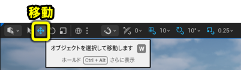

<Prerequisites>
- `OpenCampusUE90min` プロジェクトが開いていること
</Prerequisites>

ここから実際に手を動かして、コインを集めてポータルに入ってゴール、というゲームを完成させます。まずテストプレイの方法を確認し、そのあとコイン数表示とクリア条件を作っていきます。困ったら手を挙げてください。

<Section title="Step 1：テストプレイする（10〜15分）" goal="エディターでテストプレイできるようになります">

<Concept title="ビューポートとは">
Unreal Engine の画面中央にある大きな 3D ビューエリアです。ゲームのステージをリアルタイムに確認・編集する作業台として使います。
</Concept>

<Action img="./img/play-in-editor.png" alt="Unreal Editor のツールバーで、① プレイ ボタン、② 入力を受け付けるビューポートが示されているスクリーンショット">
  ①「**▶ プレイ**」をクリックしたあと、② **ビューポートをクリック**してゲーム操作を有効にします（クリックでカーソルが消えます）。
</Action>

<Recovery title="プレイから抜けられなくなったとき">
画面にゲームが映ったまま操作を受け付けない場合は、**Esc キー**を押すとテストプレイを終了できます。
</Recovery>

<Action>
  次のキーでキャラクターを動かしてみましょう。

  | キー | 動作 |
  | --- | --- |
  | **W / A / S / D** | 前後左右に移動 |
  | **Space** | ジャンプ |
  | **マウスの移動** | カメラの向きを変える |

</Action>

<Recovery title="キャラクターが動かないとき">
キーを押しても動かない場合は、ビューポートに入力が届いていません。ビューポートを 1 回クリックしてから、もう一度 W/A/S/D を押してください。
</Recovery>

<Action>
  確認できたら **Esc を押してテストプレイを終了**します。
</Action>

<Verify>W/A/S/D でキャラクターが動き、Space でジャンプし、Esc で編集画面に戻れれば成功です。</Verify>

<Checkpoint>
- W/A/S/D でキャラクターが動く
- Space でジャンプできる
- Esc でテストプレイを終了できる
</Checkpoint>

</Section>

<Section title="Step 2：BP_Coin を 10 枚以上置く（15〜30分）" goal="レベルに拾えるコインを 10 枚以上配置します">

<Concept title="BP_Coin とは">
`BP_Coin` は、触れると拾えるコインとして用意されている Blueprint クラスです。今日はこのコインを新しく作らず、すでにある `BP_Coin` をレベルに置いて使います。あとで `BP_Coin` の中を少し直すと、拾った枚数が画面に増えるようになります。
</Concept>

<Action>
  この後の作業では、ビューポートの視点を動かしながら `BP_Coin` を置きます。ビューポート内で、次の操作を試してみましょう。

  | 操作 | 動作 |
  | --- | --- |
  | **右クリック + ドラッグ** | 見る向きを変える |
  | **右クリック中に W / A / S / D** | 前後左右に移動 |
  | **右クリック中に Q / E** | 下・上に移動 |
  | **右クリック中にマウスホイール** | 移動速度を変える（上で速く、下でゆっくり） |

  プレイ中のキャラクター操作と違い、編集画面で視点を動かすときは**右クリックを押し続ける**必要があります。

</Action>

<Section title="2-1. コインを置いて場所を直す" goal="レベルにコインを 10 枚以上配置します">

<Action img="./img/bp-coin-drag-from-content-browser.png" alt="Unreal Editor で、① Content Drawer、② OpenCampus フォルダ、③ BP_Coin、④ 配置先のビューポートが示されているスクリーンショット">
  ① Content Drawer で ② `OpenCampus` フォルダを開き、③ `BP_Coin` を ④ ビューポートへドラッグ＆ドロップして配置します。
</Action>

<Action img="./img/how-to-translate-with-translation-gizmo.png" alt="ビューポート上で選択されたオブジェクトに、移動ギズモの矢印が表示されているスクリーンショット">
  移動ギズモの矢印をドラッグして、歩いて取れる高さや場所へ動かします。
</Action>

<Recovery title="矢印（移動ギズモ）が表示されないとき">
矢印が出ない場合は、`BP_Coin` が選択されていないか、移動モードになっていない可能性があります。ビューポートまたはアウトライナーで `BP_Coin` をクリックし、それでも出なければ **W キー** を押すか、 をクリックして移動モードに切り替えてください。
</Recovery>

<Action img="./img/bp-coin-placed-in-level.png" alt="① ビューポートに配置された複数のコインと、② アウトライナーに並ぶ BP_Coin が示されているスクリーンショット">
  同じ操作をくり返し、① レベル内に `BP_Coin` を 10 枚以上置きます。② アウトライナーでも枚数を確認できます。歩くだけで取れる場所を多めにし、余裕があればジャンプで取る場所も少し入れます。
</Action>

<Verify>ビューポートまたはアウトライナーで、`BP_Coin` が 10 枚以上あることを確認できれば配置完了です。</Verify>

</Section>

:::tip[こまめに保存]
作業中は、**Ctrl + Shift + S** ですべての修正をまとめて保存できます。保存していない変更は、トラブル時に失われることがあるため、修正したらこまめに保存しましょう。
:::

<Section title="2-2. 動作確認をする" goal="コインは拾えるがコイン枚数の表示は増えないことを確認します">

<Action img="./img/playtest-coin-counter-zero.png" alt="プレイ中のビューポートで、① 拾うコインと、② 0枚のままのコイン数表示が示されているスクリーンショット">
  プレイして、① 置いた `BP_Coin` を 1〜2 枚拾います。② 表示が `0枚` のまま変わらないことを確認します。
</Action>

<Action>
  確認できたら Esc でテストプレイを終了します。
</Action>

<Verify>コインは拾えますが、画面の表示が `0枚` のまま変わらない状態です。</Verify>

</Section>

<Checkpoint>
- `BP_Coin` が 10 枚以上置かれている
- コインを拾える
- 画面の表示はまだ `0枚` のままになっている
</Checkpoint>

</Section>

<Section title="Step 3：BP_Coin を拾ったときに枚数を更新する（30〜45分）" goal="コインを拾うたびに画面の枚数表示が増えるようになります">

<Section title="3-1. BP_Coin を開く" goal="コインの Blueprint を編集できるようになります">

<Action img="./img/open-bp-coin-from-content-browser.png" alt="コンテンツブラウザで、① Content Drawer、② OpenCampus フォルダ、③ BP_Coin をダブルクリックして開く操作が示されているスクリーンショット">
  ① Content Drawer で ② `OpenCampus` フォルダを開き、③ `BP_Coin` をダブルクリックして開きます。
</Action>

<Verify>Blueprint エディターが開き、`BP_Coin` の編集画面が表示されれば準備完了です。</Verify>

<Concept title="イベントグラフとは">

イベントグラフは、Blueprint の中でゲームの動きを作る場所です。
ノードを配置して、**触れたらどう動くか**を組み立てていきます。最初からある `Event ActorBeginOverlap` が「何かに触れた瞬間」のスタート地点です。

</Concept>

<Action img="./img/BP_Item-EventGraph.png" alt="イベントグラフの場所を表すスクリーンショット">
  イベントグラフ内を自由に動かして、操作に慣れましょう。

| 操作 | 動作 |
| --- | --- |
| **右クリック + ドラッグ** | グラフをスクロール（パン） |
| **マウスホイール** | ズームイン／アウト |
| **Home キー** | 全ノードが画面に収まるように表示を合わせる |

</Action>

<Action img="./img/bp-coin-yellow-comment-add-one-empty.png" alt="BP_Coin のイベントグラフで、黄色のコメントエリア「コインを1枚増やす」が示されているスクリーンショット">
  イベントグラフを操作して、黄色のコメントエリア「**コインを1枚増やす**」を見つけましょう。ここが、これから処理を追加する場所です。
</Action>

<Verify>`BP_Coin` で黄色いコメントエリア「**コインを1枚増やす**」を見つけられれば準備完了です。</Verify>

</Section>

<Section title="3-2. コイン数を 1 増やす" goal="BP_Coin が拾われたときにコイン数を 1 増やします">

<Action img="./img/bp-coin-add-get-game-instance.png" alt="BP_Coin のイベントグラフで、① 黄色いコメントエリアの空白部分、② 検索欄、③ Get Game Instance の候補が示されているスクリーンショット">
  ① 黄色いコメントエリア **コインを1枚増やす** の中の空いている場所を右クリックします。② 表示された検索欄に `Get Game Instance` と入力し、③ 候補から `Get Game Instance` を選びます。
</Action>

<Action img="./img/bp-coin-add-update-coins.png" alt="BP_Coin のイベントグラフで、① Get Game Instance の出力ピン、② 検索欄、③ Update Coins の候補が示されているスクリーンショット">
  ① `Get Game Instance` の出力ピンからドラッグし、② 空いている場所へドラップします。② 表示された検索欄に `Update Coins` と入力し、③ 候補から `Update Coins` を選びます。
</Action>

<Action img="./img/bp-coin-move-update-coins.png" alt="BP_Coin のイベントグラフで、Update Coins ノードをドラッグして、Pawn に当たった場合のみとビジュアルの更新の間に移動する操作が示されているスクリーンショット">
  `Update Coins` を「**Pawn に当たった場合のみ**」と「**ビジュアルの更新**」の2つのノードの間に位置するように、画像の辺りの位置へ移動します。
</Action>

<Action img="./img/bp-coin-connect-update-coins.png" alt="BP_Coin のイベントグラフで、Update Coins ノードの左右の白い実行ピンをそれぞれ繋ぐ操作が示されているスクリーンショット">
  `Update Coins` の左右の白い実行ピンを、それぞれ繋ぎます。左は「**Pawn に当たった場合のみ**」の実行ピンから、右は「**ビジュアルの更新**」の実行ピンへつなぎます。
</Action>

<Action img="./img/bp-coin-set-update-coins-change-one.png" alt="BP_Coin のイベントグラフで、Update Coins ノードの Change に 1 を入力する場所が示されているスクリーンショット">
  `Update Coins` の `Change` を `1` にします。
</Action>

<Concept title="「コンパイル」とは">

Blueprint のノードを組み終わったら、**コンパイル**でゲームに反映します。文書を「保存」するのに近い操作ですが、正確には「作ったノードの設定をゲームが実際に動かせる形に変換する」作業です。コンパイルしないと、ノードを変更してもゲームには反映されません。

ツールバーのコンパイルボタンのアイコンで結果がわかります。

| アイコン | 意味 |
| --- | --- |
| **緑のチェック** | 成功。ゲームに反映されました |
| **赤の ×** | エラーあり。修正が必要です |

ノードを組み終わったら一度押してアイコンを確認する習慣をつけておくと、問題を早く発見できます。

</Concept>

<Action img="./img/compile-BP_Item-and-check-result.png" alt="Blueprint エディタのツールバー。コンパイルボタンがハイライトされている">
  「**コンパイル**」をクリックします。
</Action>

<Recovery title="コンパイルアイコンが赤い × のとき">
コンパイルエラーです。画面下部の「出力ログ」パネルにエラーメッセージが表示されます。エラー行をダブルクリックすると問題のノードにジャンプできます。修正したら、もう一度「コンパイル」を押してください。
</Recovery>

<Verify img="./img/compile-success.png" alt="コンパイル成功。アイコンが緑のチェックマークになっている">コンパイルアイコンがこのような**緑のチェック**になれば設定完了です。</Verify>

</Section>

<Section title="3-3. 動作確認をする" goal="コイン表示は増えるが、ポータルがまだ反応しないことを確認します">

<Action img="./img/playtest-coin-counter-increases.png" alt="プレイ中のビューポートで、① 拾うコインと、② 1枚、2枚と増えるコイン数表示が示されているスクリーンショット">
  メインエディタに戻ってプレイし、① `BP_Coin` を数枚拾います。② 表示が増えることを確認します。
</Action>

<Action img="./img/bp-portal-not-glowing-after-10-coins.png" alt="プレイ中のビューポートで、① コインを10枚以上拾ったあと、② まだ光っていないゴールが示されているスクリーンショット">
  ① コインを 10 枚以上拾ったあと、② ゴールの近くへ移動して様子を見ます。
</Action>

<Verify>画面の枚数表示は増えますが、ゴールが光らず、入ってもクリアにならない状態です。</Verify>

</Section>

<Checkpoint>
- コインを拾うと枚数表示が増える
- 10 枚以上拾ってもゴールはまだ光らない
- ゴールに入ってもまだクリアにならない
</Checkpoint>

</Section>

<Section title="Step 4：BP_Portal のクリア条件を直す（45〜60分）" goal="10 枚以上集めてポータルに入るとゲームをクリアできるようになります">

<Section title="4-1. BP_Portal を開く" goal="ポータルの Blueprint を編集できるようになります">

<Action img="./img/open-bp-portal-from-content-browser.png" alt="① Content Drawer で ② `OpenCampus` フォルダを開き、③ `BP_Portal` をダブルクリックして開く操作が示されているスクリーンショット">
  ① Content Drawer で ② `OpenCampus` フォルダを開き、③ `BP_Portal` をダブルクリックして開きます。
</Action>

<Action img="./img/bp-portal-yellow-comment-condition-empty.png" alt="BP_Portal のイベントグラフで、① ポータルの判定処理、② 黄色のコメントエリア「集めたコインが10枚以上なら」が示されているスクリーンショット">
  イベントグラフを操作し、黄色のコメントエリア「**集めたコインが10枚以上なら**」を見つけます。ここに、これから条件の処理を追加していきます。
</Action>

<Verify>`BP_Portal` で黄色いコメントエリア「**集めたコインが10枚以上なら**」を見つけられれば準備完了です。</Verify>

</Section>

<Section title="4-2. 10 枚以上で通れる条件にする" goal="BP_Portal がコイン 10 枚以上のときだけクリア処理へ進むようになります">

<Concept title="Branch">
`Branch` は、条件が合っているときと合っていないときで処理の行き先を分けます。ここでは、コインが 10 枚以上ならポータルを有効にするために使います。
</Concept>

<Action img="./img/bp-portal-add-branch.png" alt="BP_Portal のイベントグラフで、① Event Coins Updated の実行ピン、② 空いている場所、③ 検索欄、④ Branch の候補が示されているスクリーンショット">
  ① `Event Coins Updated` の白い実行ピンからドラッグして、② 空いている場所へドロップします。③ 表示された検索欄に `Branch` と入力し、④ 候補から `Branch` を選びます。
</Action>

<Action img="./img/bp-portal-add-greater-equal.png" alt="BP_Portal のイベントグラフで、① Event Coins Updated の緑の「New Amount」からドラッグして、② 空いている場所へドロップし、③ 検索欄、④ Greater Equal (>=) の候補が示されているスクリーンショット">
  ① `Event Coins Updated` の緑の「New Amount」からドラッグして、② 空いている場所へドロップし、③ `>=` を入力して検索し、④ `Greater Equal (>=)` ノードを選びます。
</Action>

<Action img="./img/bp-portal-input-10.png" alt="BP_Portal のイベントグラフで、>= ノードの下のピンに値 10 が入力されているスクリーンショット">
  `>=` ノードの下のピンに `10` を入力します。
</Action>

<Action img="./img/bp-portal-connect-greater-equal-to-branch.png" alt="BP_Portal のイベントグラフで、>= ノードの出力ピンが Branch の Condition ピンに接続されているスクリーンショット">
  `>=` ノードの出力ピンを `Branch` の `Condition` ピンにつなぎます。
</Action>

<Action img="./img/bp-portal-connect-branch-true-to-portal.png" alt="BP_Portal のイベントグラフで、Branch ノードの True ピンが、ポータル起動の実行ピンにつながっているスクリーンショット">
  `Branch` ノードの `True` ピンを、「**ポータル起動**」の実行ピンにつなぎます。
</Action>

<Action img="./img/compile-success.png" alt="コンパイル成功の画像">
  コンパイルして、保存します。
</Action>

<Verify>コンパイルアイコンが**緑のチェック**になれば設定完了です。</Verify>

</Section>

<Section title="4-3. 完成したゲームを確認する" goal="コインを 10 枚以上集めるとポータルが光って、入るとクリアになることを確認します">

<Action img="./img/playtest-collect-10-coins.png" alt="プレイ中のビューポートで、コインを10枚集めてポータルが光るところが示されているスクリーンショット">
  プレイして、コインを10枚集めます。ポータルが光ります。
</Action>

<Action img="./img/bp-portal-glowing-and-clear.png" alt="プレイ中のビューポートで、光っているポータルに入ってゲームクリアになるところが示されているスクリーンショット">
  光っているポータルに入ります。ゲームクリアになります。
</Action>

<Verify>10 枚以上集めたあとにポータルへ入ってゲームクリアになれば完成です。</Verify>

</Section>

<Checkpoint>
- 10 枚未満ではポータルに入ってもクリアにならない
- 10 枚以上集めると `BP_Portal` が光る
- 光った `BP_Portal` に入るとゲームクリアになる
</Checkpoint>

</Section>

<Section title="Step 5：クリアに必要なコイン数を調整する（60〜70分）" goal="BP_Portal の数字を変えて、クリア条件を自分で調整できるようになります">

<Concept title="しきい値とは">
しきい値は、「この数以上なら OK」と決める境目の数字です。`>= 10` の `10` を変えると、何枚集めたら `BP_Portal` が反応するかを調整できます。ゲームの難しさを変えるときは、見た目だけでなく、このような条件の数字も調整します。
</Concept>

<Section title="5-1. 3 枚でクリアできるようにする" goal="少ないコイン数でもクリアできる条件に変えます">

<Action img="./img/bp-portal-condition-greater-equal-3.png" alt="BP_Portal のイベントグラフで、① 比較ノード、② しきい値 3 が示されているスクリーンショット">
  再度 `BP_Portal` を開き、条件を `>= 3` に変更してから、コンパイルして保存します。
</Action>

<Action img="./img/playtest-collect-3-coins.png" alt="プレイ中のビューポートで、コインを3枚集めてポータルが光るところが示されているスクリーンショット">
  プレイして、コインを 3 枚集めてみましょう。ポータルが光って、入るとクリアになります。
</Action>

<Verify>3 枚でゲームクリアになれば、条件の数字でゲームのクリア条件を変えられることを確認できています。</Verify>

</Section>

<Section title="5-2. 自分でルールを決める" goal="自分でクリア条件を好きな数値に決めます">

<Action img="./img/bp-portal-condition-restored.png" alt="BP_Portal のイベントグラフで、① 比較ノード、② 10 もしくは自分で選んだしきい値が示されているスクリーンショット">
  再度 `BP_Portal` を開き、`>=` の条件の数値を、自分がクリア条件にしたい数値に変更して、コンパイルして保存します。
</Action>

<Verify>選んだ数字どおりに `BP_Portal` が反応すれば、ゲームのルール調整は完了です。</Verify>

</Section>

<Checkpoint>
- `>= 3` にすると 3 枚でクリアできる
- `>=` の数値を変えると、クリアに必要なコイン数を自分で調整できる
</Checkpoint>

</Section>

<Section title="追加ミッション：ジャンプ台を作ろう（70〜85分）" goal="Collision にイベントを追加し、プレイヤーを上へ飛ばすジャンプ台を完成させます">

ここまでで、最初にプレイした基本ゲームは完成です。ここからは、完成見本にはなかった新しい機能を追加します。

<Section title="1. BP_JumpPad を置く" goal="ジャンプ台をステージに配置し、まだ動かないことを確認します">

<Action img="./img/bp-jump-pad-drag-from-content-browser.webp" alt="Content Drawer から BP_JumpPad をビューポートへドラッグ＆ドロップして配置するスクリーンショット">
  Content Drawer の `OpenCampus` フォルダにある `BP_JumpPad` を、ビューポートへドラッグ＆ドロップします。
</Action>

<Action>
  移動ギズモを使って、キャラクターが上に乗れる場所へ移動します。
</Action>

<Action>
  プレイ中にキャラクターを操作して、`BP_JumpPad` の上へ移動します。
</Action>

<Verify>ジャンプ台の上に乗っても、まだ上へ飛ばなければ確認完了です。</Verify>

</Section>

<Section title="2. Collision の範囲を確認する" goal="ジャンプ台が接触を検出する範囲を確認します">

<Action>
  Content Drawer の `OpenCampus` フォルダにある `BP_JumpPad` をダブルクリックします。
</Action>

<Concept title="Collision とは">
`Collision` は、プレイヤーやほかの物体が触れたり、範囲内へ入ったりしたことを検出するための、見えない判定範囲です。
</Concept>

<Action img="./img/bp-jump-pad-open-viewport-tab.webp" alt="BP_JumpPad の Blueprint エディターで Viewport タブをクリックするスクリーンショット">
  `Viewport` タブをクリックします。
</Action>

<Action img="./img/bp-jump-pad-collision-in-viewport.webp" alt="BP_JumpPad の Viewport で Collision を選択し、ジャンプ台の判定範囲を確認するスクリーンショット">
  Components の `Collision` をクリックします。
</Action>

<Verify>ジャンプ台の上部に Collision の判定範囲が表示されていれば完了です。</Verify>

</Section>

<Section title="3. Collision に入ったときのイベントを追加する" goal="Collision に触れた瞬間から始まるイベントを追加します">

<Action img="./img/bp-jump-pad-add-overlap-event.webp" alt="BP_JumpPad の Components で Collision を右クリックし、Add Event から Add OnComponentBeginOverlap を選ぶスクリーンショット">
  Components の `Collision` を右クリックし、`Add Event`、`Add OnComponentBeginOverlap` の順にクリックします。
</Action>

<Concept title="On Component Begin Overlap">
`On Component Begin Overlap` は、ほかの物体が Collision の範囲内へ入った瞬間に始まるイベントです。

ノード名の末尾の `(Collision)` というのは、先ほど確認した `Collision` に対するイベントだということを表しています。
</Concept>

<Verify img="./img/bp-jump-pad-begin-overlap-added.webp" alt="BP_JumpPad の Event Graph に On Component Begin Overlap (Collision) が追加されたスクリーンショット">Event Graph に `On Component Begin Overlap (Collision)` が追加されていれば完了です。</Verify>

</Section>

<Section title="4. 触れた相手が Character か確認する" goal="ジャンプ台に触れた相手を Character として扱える場合だけ処理を進めます">

<Concept title="Other Actor">
`On Component Begin Overlap (Collision)` の `Other Actor` には、Collision に触れた相手が入ります。プレイヤーが触れた場合は、プレイヤーキャラクターが入ります。
</Concept>

<Concept title="Cast To Character">
`Cast To Character` は、触れた相手を Character として扱えるか確認するノードです。成功したときだけ Character 用の処理へ進めます。
</Concept>

<Action img="./img/bp-jump-pad-add-cast-to-character.webp" alt="BP_JumpPad の Event Graph で Other Actor から Cast To Character を追加するスクリーンショット">
  `Other Actor` のピンからドラッグし、検索欄に `Cast To Character` と入力して、`Cast To Character` を追加します。
</Action>

<Verify img="./img/bp-jump-pad-cast-character-connected.webp" alt="BP_JumpPad の Event Graph で Other Actor から Cast To Character を追加し、Object と白い実行ピンが自動接続されたスクリーンショット">
  `Other Actor` が `Object` につながり、白い実行線も `Cast To Character` へ自動でつながっていれば完了です。
</Verify>

</Section>

<Section title="5. Launch Character を追加する" goal="Character に上方向の速度を与える処理を追加します">

<Concept title="Launch Character">
`Launch Character` は、Character に速度を与えて飛ばすノードです。今回は上方向の速度を与えて、ジャンプ台として使います。
</Concept>

<Action img="./img/bp-jump-pad-add-launch-character.webp" alt="BP_JumpPad の Event Graph で As Character の青いピンからドラッグし、Launch Character を検索して追加するスクリーンショット">
  `As Character` の青いピンからドラッグし、`Launch Character` を検索して追加します。
</Action>

<Verify img="./img/bp-jump-pad-launch-character-connected.webp" alt="BP_JumpPad の Event Graph で  As Character から Launch Character が追加され、Target と白い実行ピンが自動接続されたスクリーンショット">
  `As Character` が `Target` につながり、白い実行線も `Launch Character` へ自動でつながっていれば完了です。
</Verify>

</Section>

<Section title="6. 上方向の速度を設定する" goal="プレイヤーが上へ飛ぶ強さを設定します">

<Concept title="Launch Velocity">
`Launch Velocity` は、Character をどの方向へ、どのくらいの強さで飛ばすかを表します。X と Y は水平方向、Z は上下方向です。
</Concept>

<Action img="./img/bp-jump-pad-set-launch-velocity-z.webp" alt="Launch Character ノードの Launch Velocity で Z に 1200 を入力するスクリーンショット">
  `Launch Character` の `Launch Velocity` の Z に `1200` を入力します。
</Action>

<Action img="./img/bp-jump-pad-enable-z-override.webp" alt="Launch Character ノードの Z Override をオンにするスクリーンショット">
  `Launch Character` の `Z Override` をオンにします。
</Action>

<Verify img="./img/bp-jump-pad-blueprint-complete.webp" alt="BP_JumpPad の Event Graph で On Component Begin Overlap (Collision)、Cast To Character、Launch Character が接続され、Launch Velocity の Z が 1200 に設定された完成状態のスクリーンショット">
  `On Component Begin Overlap (Collision)`、`Cast To Character`、`Launch Character` が接続され、`Launch Velocity` の Z が `1200` に設定されていれば完了です。
</Verify>

</Section>

<Section title="7. コンパイルして試す" goal="ジャンプ台に乗るとプレイヤーが上へ飛ぶことを確認します">

コンパイルして保存し、メインエディターでプレイを開始します。

<Action>
  キャラクターを操作して、自分で置いたジャンプ台の上へ移動します。
</Action>

<Recovery title="ジャンプ台に乗っても飛ばないとき">
次を順番に確認してください。

- `On Component Begin Overlap (Collision)` が追加されている
- `Other Actor` が `Cast To Character` の `Object` につながっている
- `As Character` が `Launch Character` の `Target` につながっている
- 白い実行線が途中で切れていない
- `Launch Velocity` の Z が `1200` になっている
- `Z Override` がオンになっている
</Recovery>

<Verify img="./img/bp-jump-pad-launch-in-play.png" alt="プレイ中にキャラクターが BP_JumpPad から上へ飛んでいるスクリーンショット">ジャンプ台に乗ったとき、プレイヤーが上へ飛べば追加ミッション成功です。</Verify>

</Section>

<Checkpoint>
- `BP_JumpPad` を自分でステージに置いている
- `Collision` から `On Component Begin Overlap (Collision)` を追加している
- `Cast To Character` と `Launch Character` が正しくつながっている
- プレイするとジャンプ台から上へ飛べる
</Checkpoint>

</Section>

<Section title="任意：時間が余った場合（85〜90分）" goal="ジャンプ台やコインを調整し、ゲームをさらに改造します">

ここからは時間が余ったときだけ進めます。ジャンプ台が動けば、この授業の必須部分は完了です。

### 演習-発展1：ジャンプの強さを変える

<Exercise>

`Launch Character` の `Launch Velocity` の Z を変更し、ジャンプの高さを変えてください。

- `700`：低いジャンプ
- `1200`：標準のジャンプ
- `1800`：高いジャンプ

<Verify>数値を変えてコンパイルすると、ジャンプの高さが変われば成功です。</Verify>

<Hint>
Z の数値が大きいほど、上方向へ強く飛びます。
</Hint>

<Answer>
`Launch Velocity` の Z を変更し、コンパイルしてからプレイします。選んだ数値に応じてジャンプの高さが変われば完了です。
</Answer>

</Exercise>

### 演習-発展2：空中のコインを取れるコースを作る

<Exercise>

通常のジャンプでは届かない位置へ `BP_Coin` を1枚以上置き、ジャンプ台を使えば取れるように配置を調整してください。

<Verify>ジャンプ台から飛び、空中に置いたコインを取れれば成功です。</Verify>

<Hint>
先にジャンプ台の高さを確認し、その軌道の近くへコインを置くと調整しやすくなります。
</Hint>

<Answer>
ジャンプ台で飛んだときに通る位置へコインを移動し、プレイして実際に取れることを確認します。
</Answer>

</Exercise>

### 演習-発展3：コインを回転させる

<Exercise>

<Section title="コインを回転させる" goal="コインの見た目が時間に合わせて回るようになります">

<Action img="./img/open-m-coin-material.png" alt="Unreal Editor で、M_Coin のマテリアルエディタを開くスクリーンショット">
  ① `Content Drawer` で `OpenCampus` フォルダを開き、`M_Coin` をダブルクリックしてマテリアルエディタを開きます。
</Action>

<Action img="./img/m-coin-yellow-comment-rotate-empty.png" alt="M_Coin のマテリアルグラフで、時間経過でコインを回すコメントエリアが示されているスクリーンショット">
  `M_Coin` のマテリアルグラフで、黄色のコメントエリア「**時間経過でコインを回す**」を見つけます。
</Action>

<Action img="./img/m-coin-add-time-node.png" alt="M_Coin のマテリアルグラフで、① 黄色いコメントエリアの空白部分、② 検索欄、③ Time ノードの候補が示されているスクリーンショット">
  ① 黄色いコメントエリア **時間経過でコインを回す** の中の空いている場所を右クリックし、② 検索欄に `Time` と入力して、③ `Time` ノードを追加します。
</Action>

<Action img="./img/m-coin-time-to-a-wired.png" alt="M_Coin のマテリアルグラフで、Time ノードの出力と Multiply ノードの A ピンの接続が示されているスクリーンショット">
  `Time` ノードの出力ピンを、すぐ右の `Multiply` ノードの `A` ピンにつなぎます。
</Action>

<Action img="./img/m-coin-rotate-preview.png" alt="プレイ中のビューポートで、回転しているコインが示されているスクリーンショット">
  プレビューでコインが回るようになったことを確認します。
</Action>

<Action img="./img/m-coin-apply-changes.png" alt="M_Coin のマテリアルエディタで、Apply ボタンが示されているスクリーンショット">
  `Apply` を押して、保存し、プレイします。
</Action>

<Verify img="./img/m-coin-rotating-in-pie.png" alt="プレイ中にコインが回転している様子が示されているスクリーンショット">コインが回っていれば成功です。</Verify>

</Section>

<Hint>
`Time` ノードの値を使うと、時間の経過に合わせて回転角度を変えられます。`M_Coin` の黄色いコメントエリアで、`Time` ノードを回転用の計算につなげてみましょう。
</Hint>

<Answer>
`Time` ノードを追加して回転用の計算につなぎ、プレビューでコインが回ることを確認します。最後に `Apply` を押して保存し、Play In Editor でもコインが回っていれば完了です。
</Answer>

</Exercise>

</Section>

<NextSteps>
- コインの配置を工夫して、ゲームの難易度を調整してみましょう
- ステージの続きを作って、ゴールまでの道のりを長くしてみましょう
</NextSteps>
